<!-- GENERATED:MODEL -->
---
tags: [odoo, enterprise, generated, model]
---

# l10n_es_reports.real.estate

- Module: [[docs/Enterprise Addons/l10n_es_real_estates/l10n_es_real_estates|l10n_es_real_estates]]
- Scope: Enterprise Addons
- Defined in module: yes
- Source files: `models/real_estate.py`
- Python classes: `L10n_Es_ReportsRealEstate`
- Description: Real Estate

## Field footprint

- Detected fields: 19
- Field types: `Char` x 14, `Integer` x 1, `One2many` x 1, `Selection` x 3
- Relation fields: 1

## Sample fields

- `address_complement`: `Char`
- `cadastral_reference`: `Selection`
- `city`: `Char`
- `door`: `Char`
- `floor`: `Char`
- `invoice_ids`: `One2many` (comodel `account.move`)
- `municipality`: `Char`
- `municipality_code`: `Char`
- `name`: `Char`
- `portal`: `Char`
- `postal_code`: `Char`
- `province_code`: `Char`
- `stairs`: `Char`
- `street_block`: `Char`
- `street_name`: `Char`
- `street_number`: `Integer`
- `street_number_km_qualifier`: `Selection`
- `street_number_type`: `Selection`
- `street_type`: `Char`

## Method hints

- Detected methods: 0
- Action methods: none
- Compute methods: none
- Onchange methods: none

## Direct relation diagram

```plantuml
@startuml
!define ODOO_COLOR_PRIMARY #714B67
!define ODOO_COLOR_ACCENT #875A7B
!define ODOO_COLOR_BG #FAF7FA

skinparam backgroundColor ODOO_COLOR_BG
skinparam defaultTextAlignment left
skinparam ArrowColor ODOO_COLOR_ACCENT
skinparam ClassBackgroundColor white
skinparam ClassBorderColor ODOO_COLOR_PRIMARY
skinparam ComponentBackgroundColor white
skinparam ComponentBorderColor ODOO_COLOR_PRIMARY
skinparam NoteBackgroundColor #FFF8FF
skinparam NoteBorderColor ODOO_COLOR_ACCENT
skinparam SequenceLifeLineBorderColor ODOO_COLOR_ACCENT
skinparam SequenceLifeLineBackgroundColor #FFFFFF
skinparam SequenceParticipantBorderColor ODOO_COLOR_PRIMARY
skinparam SequenceParticipantBackgroundColor #FFFFFF
skinparam sequence {
  ArrowColor ODOO_COLOR_ACCENT
  ActorBorderColor ODOO_COLOR_PRIMARY
}
title l10n_es_reports.real.estate - Direct Relations
class "l10n_es_reports.real.estate" as l10n_es_reports_real_estate
class "account.move" as account_move
l10n_es_reports_real_estate --|> account_move : invoice_ids
@enduml
```

## Navigation

- **Parent:** [[docs/Enterprise Addons/l10n_es_real_estates/Models]]

<!-- GENERATED:MODEL -->
