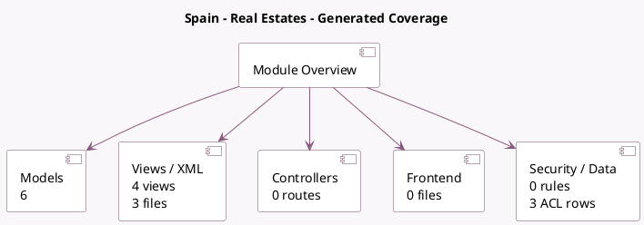

<!-- GENERATED:MODULE -->
---
tags: [odoo, enterprise, module]
---

# Spain - Real Estates

- Scope: Enterprise Addons
- Source: enterprise/l10n_es_real_estates
- Dependencies: [[docs/Enterprise Addons/l10n_es_reports/l10n_es_reports|l10n_es_reports]]

## Generated coverage

- Models: 6
- XML files with UI/data artifacts: 3
- Views: 4
- Actions: 0
- Menus: 0
- Rules (ir.rule): 0
- Access CSV entries: 3
- Controller units: 0
- Frontend asset files: 0

## Module map

## Detail notes

- Models: [[docs/Enterprise Addons/l10n_es_real_estates/Models|Models]] (6)
- Views and XML: [[docs/Enterprise Addons/l10n_es_real_estates/Views|Views]] (3 files)

## Key models

- `account.move`
- `account.move.line`
- `l10n_es.mod347.tax.report.handler`
- `l10n_es_reports.aeat.boe.mod347.export.wizard`
- `l10n_es_reports.aeat.mod347.real.estates.vat`
- `l10n_es_reports.real.estate`

## Navigation

- [[../Enterprise Addons/Enterprise Addons|Back to scope]]
- [[../../docs/docs|Back to docs]]

<!-- GENERATED:MODULE -->

