<!-- GENERATED:MODEL -->
---
tags: [odoo, enterprise, generated, model]
---

# l10n_es_reports.aeat.boe.export.wizard

- Module: [[docs/Enterprise Addons/l10n_es_reports/l10n_es_reports|l10n_es_reports]]
- Scope: Enterprise Addons
- Defined in module: yes
- Source files: `wizard/aeat_boe_export_wizards.py`
- Python classes: `L10n_Es_ReportsAeatBoeExportWizard`
- Description: BOE Export Wizard

## Field footprint

- Detected fields: 2
- Field types: `Many2one` x 2
- Relation fields: 2

## Sample fields

- `calling_export_wizard_id`: `Many2one` (comodel `account_reports.export.wizard`)
- `report_id`: `Many2one` (comodel `account.report`)

## Method hints

- Detected methods: 2
- Action methods: `action_proceed_with_locking`
- Compute methods: none
- Onchange methods: none

## Direct relation diagram

```plantuml
@startuml
!define ODOO_COLOR_PRIMARY #714B67
!define ODOO_COLOR_ACCENT #875A7B
!define ODOO_COLOR_BG #FAF7FA

skinparam backgroundColor ODOO_COLOR_BG
skinparam defaultTextAlignment left
skinparam ArrowColor ODOO_COLOR_ACCENT
skinparam ClassBackgroundColor white
skinparam ClassBorderColor ODOO_COLOR_PRIMARY
skinparam ComponentBackgroundColor white
skinparam ComponentBorderColor ODOO_COLOR_PRIMARY
skinparam NoteBackgroundColor #FFF8FF
skinparam NoteBorderColor ODOO_COLOR_ACCENT
skinparam SequenceLifeLineBorderColor ODOO_COLOR_ACCENT
skinparam SequenceLifeLineBackgroundColor #FFFFFF
skinparam SequenceParticipantBorderColor ODOO_COLOR_PRIMARY
skinparam SequenceParticipantBackgroundColor #FFFFFF
skinparam sequence {
  ArrowColor ODOO_COLOR_ACCENT
  ActorBorderColor ODOO_COLOR_PRIMARY
}
title l10n_es_reports.aeat.boe.export.wizard - Direct Relations
class "l10n_es_reports.aeat.boe.export.wizard" as l10n_es_reports_aeat_boe_export_wizard
class "account.report" as account_report
class "account_reports.export.wizard" as account_reports_export_wizard
l10n_es_reports_aeat_boe_export_wizard --> account_report : report_id
l10n_es_reports_aeat_boe_export_wizard --> account_reports_export_wizard : calling_export_wizard_id
@enduml
```

## Navigation

- **Parent:** [[docs/Enterprise Addons/l10n_es_reports/Models]]

<!-- GENERATED:MODEL -->
