<!-- GENERATED:MODEL -->
---
tags: [odoo, enterprise, generated, model]
---

# l10n_es_reports.aeat.boe.mod111and115and303.export.wizard

- Module: [[docs/Enterprise Addons/l10n_es_reports/l10n_es_reports|l10n_es_reports]]
- Scope: Enterprise Addons
- Defined in module: yes
- Source files: `wizard/aeat_boe_export_wizards.py`
- Python classes: `L10n_Es_ReportsAeatBoeMod111and115and303ExportWizard`
- Description: BOE Export Wizard for (mod111, mod115 & 303)
- Inherits: `l10n_es_reports.aeat.boe.export.wizard`

## Field footprint

- Detected fields: 6
- Field types: `Boolean` x 1, `Char` x 1, `Many2one` x 3, `Selection` x 1
- Relation fields: 3

## Sample fields

- `company_id`: `Many2one` (comodel `res.company`)
- `company_partner_id`: `Many2one` (comodel `res.partner`, related `company_id.partner_id`)
- `complementary_declaration`: `Boolean`
- `declaration_type`: `Selection`
- `partner_bank_id`: `Many2one` (comodel `res.partner.bank`)
- `previous_report_number`: `Char`

## Method hints

- Detected methods: 2
- Action methods: none
- Compute methods: none
- Onchange methods: none

## Direct relation diagram

```plantuml
@startuml
!define ODOO_COLOR_PRIMARY #714B67
!define ODOO_COLOR_ACCENT #875A7B
!define ODOO_COLOR_BG #FAF7FA

skinparam backgroundColor ODOO_COLOR_BG
skinparam defaultTextAlignment left
skinparam ArrowColor ODOO_COLOR_ACCENT
skinparam ClassBackgroundColor white
skinparam ClassBorderColor ODOO_COLOR_PRIMARY
skinparam ComponentBackgroundColor white
skinparam ComponentBorderColor ODOO_COLOR_PRIMARY
skinparam NoteBackgroundColor #FFF8FF
skinparam NoteBorderColor ODOO_COLOR_ACCENT
skinparam SequenceLifeLineBorderColor ODOO_COLOR_ACCENT
skinparam SequenceLifeLineBackgroundColor #FFFFFF
skinparam SequenceParticipantBorderColor ODOO_COLOR_PRIMARY
skinparam SequenceParticipantBackgroundColor #FFFFFF
skinparam sequence {
  ArrowColor ODOO_COLOR_ACCENT
  ActorBorderColor ODOO_COLOR_PRIMARY
}
title l10n_es_reports.aeat.boe.mod111and115and303.export.wizard - Direct Relations
class "l10n_es_reports.aeat.boe.mod111and115and303.export.wizard" as l10n_es_reports_aeat_boe_mod111and115and303_export_wizard
class "res.company" as res_company
class "res.partner" as res_partner
class "res.partner.bank" as res_partner_bank
l10n_es_reports_aeat_boe_mod111and115and303_export_wizard --> res_company : company_id
l10n_es_reports_aeat_boe_mod111and115and303_export_wizard --> res_partner : company_partner_id
l10n_es_reports_aeat_boe_mod111and115and303_export_wizard --> res_partner_bank : partner_bank_id
@enduml
```

## Navigation

- **Parent:** [[docs/Enterprise Addons/l10n_es_reports/Models]]

<!-- GENERATED:MODEL -->
