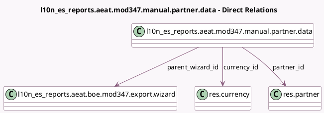

<!-- GENERATED:MODEL -->
---
tags: [odoo, enterprise, generated, model]
---

# l10n_es_reports.aeat.mod347.manual.partner.data

- Module: [[docs/Enterprise Addons/l10n_es_reports/l10n_es_reports|l10n_es_reports]]
- Scope: Enterprise Addons
- Defined in module: yes
- Source files: `wizard/aeat_boe_export_wizards.py`
- Python classes: `L10n_Es_ReportsAeatMod347ManualPartnerData`
- Description: Manually Entered Data for Mod 347 Report

## Field footprint

- Detected fields: 6
- Field types: `Many2one` x 3, `Monetary` x 1, `Selection` x 2
- Relation fields: 3

## Sample fields

- `currency_id`: `Many2one` (comodel `res.currency`)
- `operation_class`: `Selection`
- `operation_key`: `Selection`
- `parent_wizard_id`: `Many2one` (comodel `l10n_es_reports.aeat.boe.mod347.export.wizard`)
- `partner_id`: `Many2one` (comodel `res.partner`)
- `perceived_amount`: `Monetary`

## Method hints

- Detected methods: 0
- Action methods: none
- Compute methods: none
- Onchange methods: none

## Direct relation diagram

## Navigation

- **Parent:** [[docs/Enterprise Addons/l10n_es_reports/Models]]

<!-- GENERATED:MODEL -->
