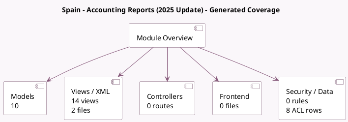

<!-- GENERATED:MODULE -->
---
tags: [odoo, enterprise, module]
---

# Spain - Accounting Reports (2025 Update)

- Scope: Enterprise Addons
- Source: enterprise/l10n_es_reports_2025
- Dependencies: [[docs/Enterprise Addons/l10n_es_reports/l10n_es_reports|l10n_es_reports]]

## Generated coverage

- Models: 10
- XML files with UI/data artifacts: 2
- Views: 14
- Actions: 0
- Menus: 0
- Rules (ir.rule): 0
- Access CSV entries: 8
- Controller units: 0
- Frontend asset files: 0

## Module map

## Detail notes

- Models: [[docs/Enterprise Addons/l10n_es_reports_2025/Models|Models]] (10)
- Views and XML: [[docs/Enterprise Addons/l10n_es_reports_2025/Views|Views]] (2 files)

## Key models

- `account.return`
- `account.return.type`
- `l10n_es_reports_2025.mod111.submission.wizard`
- `l10n_es_reports_2025.mod115.submission.wizard`
- `l10n_es_reports_2025.mod130.submission.wizard`
- `l10n_es_reports_2025.mod303.submission.wizard`
- `l10n_es_reports_2025.mod347.submission.wizard`
- `l10n_es_reports_2025.mod349.submission.wizard`
- `l10n_es_reports_2025.mod390.submission.wizard`
- `l10n_es_reports_2025.modelos.submission.wizard`

## Navigation

- [[../Enterprise Addons/Enterprise Addons|Back to scope]]
- [[../../docs/docs|Back to docs]]

<!-- GENERATED:MODULE -->

