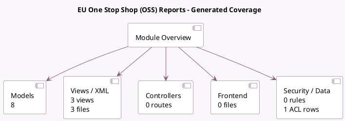

<!-- GENERATED:MODULE -->
---
tags: [odoo, enterprise, module]
---

# EU One Stop Shop (OSS) Reports

- Scope: Enterprise Addons
- Source: enterprise/l10n_eu_oss_reports
- Dependencies: [[docs/Enterprise Addons/account_reports/account_reports|account_reports]], [[docs/Community Addons/l10n_eu_oss/l10n_eu_oss|l10n_eu_oss]]

## Generated coverage

- Models: 8
- XML files with UI/data artifacts: 3
- Views: 3
- Actions: 0
- Menus: 0
- Rules (ir.rule): 0
- Access CSV entries: 1
- Controller units: 0
- Frontend asset files: 0

## Module map

## Detail notes

- Models: [[docs/Enterprise Addons/l10n_eu_oss_reports/Models|Models]] (8)
- Views and XML: [[docs/Enterprise Addons/l10n_eu_oss_reports/Views|Views]] (3 files)

## Key models

- `account.report`
- `account.return`
- `account.return.type`
- `l10n_eu_oss.imports.tax.report.handler`
- `l10n_eu_oss.sales.tax.report.handler`
- `l10n_eu_oss.tax.report.handler`
- `l10n_eu_oss_reports.return.submission.wizard`
- `res.company`

## Navigation

- [[../Enterprise Addons/Enterprise Addons|Back to scope]]
- [[../../docs/docs|Back to docs]]

<!-- GENERATED:MODULE -->

