<!-- GENERATED:MODEL -->
---
tags: [odoo, enterprise, generated, model]
---

# account.fec.import.wizard

- Module: [[docs/Enterprise Addons/l10n_fr_fec_import/l10n_fr_fec_import|l10n_fr_fec_import]]
- Scope: Enterprise Addons
- Defined in module: yes
- Source files: `wizard/import_wizard.py`
- Python classes: `AccountFecImportWizard`
- Description: Account FEC import wizard

## Field footprint

- Detected fields: 4
- Field types: `Char` x 1, `Many2one` x 2, `Selection` x 1
- Relation fields: 2

## Sample fields

- `company_id`: `Many2one` (comodel `res.company`)
- `document_prefix`: `Char`
- `duplicate_documents_handling`: `Selection`
- `import_summary_id`: `Many2one` (comodel `account.import.summary`)

## Method hints

- Detected methods: 20
- Action methods: none
- Compute methods: none
- Onchange methods: none

## Direct relation diagram

```plantuml
@startuml
!define ODOO_COLOR_PRIMARY #714B67
!define ODOO_COLOR_ACCENT #875A7B
!define ODOO_COLOR_BG #FAF7FA

skinparam backgroundColor ODOO_COLOR_BG
skinparam defaultTextAlignment left
skinparam ArrowColor ODOO_COLOR_ACCENT
skinparam ClassBackgroundColor white
skinparam ClassBorderColor ODOO_COLOR_PRIMARY
skinparam ComponentBackgroundColor white
skinparam ComponentBorderColor ODOO_COLOR_PRIMARY
skinparam NoteBackgroundColor #FFF8FF
skinparam NoteBorderColor ODOO_COLOR_ACCENT
skinparam SequenceLifeLineBorderColor ODOO_COLOR_ACCENT
skinparam SequenceLifeLineBackgroundColor #FFFFFF
skinparam SequenceParticipantBorderColor ODOO_COLOR_PRIMARY
skinparam SequenceParticipantBackgroundColor #FFFFFF
skinparam sequence {
  ArrowColor ODOO_COLOR_ACCENT
  ActorBorderColor ODOO_COLOR_PRIMARY
}
title account.fec.import.wizard - Direct Relations
class "account.fec.import.wizard" as account_fec_import_wizard
class "account.import.summary" as account_import_summary
class "res.company" as res_company
account_fec_import_wizard --> res_company : company_id
account_fec_import_wizard --> account_import_summary : import_summary_id
@enduml
```

## Navigation

- **Parent:** [[docs/Enterprise Addons/l10n_fr_fec_import/Models]]

<!-- GENERATED:MODEL -->
