<!-- GENERATED:MODEL -->
---
tags: [odoo, enterprise, generated, model]
---

# account.report.async.document

- Module: [[docs/Enterprise Addons/l10n_fr_reports/l10n_fr_reports|l10n_fr_reports]]
- Scope: Enterprise Addons
- Defined in module: yes
- Source files: `models/account_report_async_document.py`
- Python classes: `AccountReportAsyncDocument`
- Description: Account Report Async Document

## Field footprint

- Detected fields: 10
- Field types: `Binary` x 1, `Char` x 6, `Html` x 1, `Many2one` x 1, `Selection` x 1
- Relation fields: 1

## Sample fields

- `account_report_async_export_id`: `Many2one` (comodel `account.report.async.export`)
- `attachment`: `Binary`
- `attachment_name`: `Char`
- `declaration_uid`: `Char`
- `deposit_uid`: `Char`
- `message`: `Html` (compute `_compute_message`)
- `name`: `Char`
- `state`: `Selection`
- `step_1_logs`: `Char`
- `step_2_logs`: `Char`

## Method hints

- Detected methods: 10
- Action methods: none
- Compute methods: `_compute_message`
- Onchange methods: none

## Direct relation diagram

```plantuml
@startuml
!define ODOO_COLOR_PRIMARY #714B67
!define ODOO_COLOR_ACCENT #875A7B
!define ODOO_COLOR_BG #FAF7FA

skinparam backgroundColor ODOO_COLOR_BG
skinparam defaultTextAlignment left
skinparam ArrowColor ODOO_COLOR_ACCENT
skinparam ClassBackgroundColor white
skinparam ClassBorderColor ODOO_COLOR_PRIMARY
skinparam ComponentBackgroundColor white
skinparam ComponentBorderColor ODOO_COLOR_PRIMARY
skinparam NoteBackgroundColor #FFF8FF
skinparam NoteBorderColor ODOO_COLOR_ACCENT
skinparam SequenceLifeLineBorderColor ODOO_COLOR_ACCENT
skinparam SequenceLifeLineBackgroundColor #FFFFFF
skinparam SequenceParticipantBorderColor ODOO_COLOR_PRIMARY
skinparam SequenceParticipantBackgroundColor #FFFFFF
skinparam sequence {
  ArrowColor ODOO_COLOR_ACCENT
  ActorBorderColor ODOO_COLOR_PRIMARY
}
title account.report.async.document - Direct Relations
class "account.report.async.document" as account_report_async_document
class "account.report.async.export" as account_report_async_export
account_report_async_document --> account_report_async_export : account_report_async_export_id
@enduml
```

## Navigation

- **Parent:** [[docs/Enterprise Addons/l10n_fr_reports/Models]]

<!-- GENERATED:MODEL -->
