<!-- GENERATED:MODEL -->
---
tags: [odoo, enterprise, generated, model]
---

# account.report.async.export

- Module: [[docs/Enterprise Addons/l10n_fr_reports/l10n_fr_reports|l10n_fr_reports]]
- Scope: Enterprise Addons
- Defined in module: yes
- Source files: `models/account_report_async_export.py`
- Python classes: `AccountReportAsyncExport`
- Description: Account Report Async Export

## Field footprint

- Detected fields: 7
- Field types: `Char` x 1, `Date` x 2, `Many2one` x 1, `One2many` x 1, `Selection` x 2
- Relation fields: 2

## Sample fields

- `date_from`: `Date`
- `date_to`: `Date`
- `document_ids`: `One2many` (comodel `account.report.async.document`)
- `name`: `Char`
- `recipient`: `Selection`
- `report_id`: `Many2one` (comodel `account.report`)
- `state`: `Selection` (compute `_compute_state`, store `True`)

## Method hints

- Detected methods: 3
- Action methods: none
- Compute methods: `_compute_state`
- Onchange methods: none

## Direct relation diagram

```plantuml
@startuml
!define ODOO_COLOR_PRIMARY #714B67
!define ODOO_COLOR_ACCENT #875A7B
!define ODOO_COLOR_BG #FAF7FA

skinparam backgroundColor ODOO_COLOR_BG
skinparam defaultTextAlignment left
skinparam ArrowColor ODOO_COLOR_ACCENT
skinparam ClassBackgroundColor white
skinparam ClassBorderColor ODOO_COLOR_PRIMARY
skinparam ComponentBackgroundColor white
skinparam ComponentBorderColor ODOO_COLOR_PRIMARY
skinparam NoteBackgroundColor #FFF8FF
skinparam NoteBorderColor ODOO_COLOR_ACCENT
skinparam SequenceLifeLineBorderColor ODOO_COLOR_ACCENT
skinparam SequenceLifeLineBackgroundColor #FFFFFF
skinparam SequenceParticipantBorderColor ODOO_COLOR_PRIMARY
skinparam SequenceParticipantBackgroundColor #FFFFFF
skinparam sequence {
  ArrowColor ODOO_COLOR_ACCENT
  ActorBorderColor ODOO_COLOR_PRIMARY
}
title account.report.async.export - Direct Relations
class "account.report.async.export" as account_report_async_export
class "account.report" as account_report
class "account.report.async.document" as account_report_async_document
account_report_async_export --> account_report : report_id
account_report_async_export --|> account_report_async_document : document_ids
@enduml
```

## Navigation

- **Parent:** [[docs/Enterprise Addons/l10n_fr_reports/Models]]

<!-- GENERATED:MODEL -->
