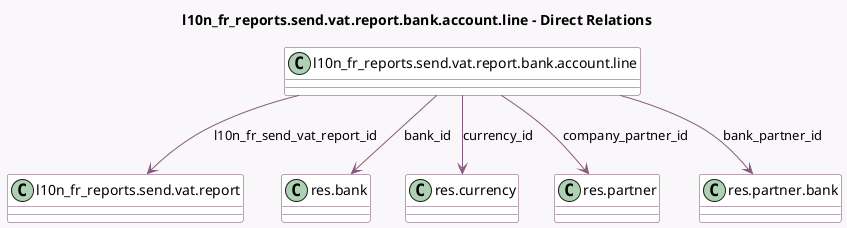

<!-- GENERATED:MODEL -->
---
tags: [odoo, enterprise, generated, model]
---

# l10n_fr_reports.send.vat.report.bank.account.line

- Module: [[docs/Enterprise Addons/l10n_fr_reports/l10n_fr_reports|l10n_fr_reports]]
- Scope: Enterprise Addons
- Defined in module: yes
- Source files: `wizard/l10n_fr_send_vat_report.py`
- Python classes: `L10n_Fr_ReportsSendVatReportBankAccountLine`
- Description: Bank Account Line for French Vat Report

## Field footprint

- Detected fields: 11
- Field types: `Boolean` x 1, `Char` x 2, `Date` x 1, `Many2one` x 5, `Monetary` x 1, `Selection` x 1
- Relation fields: 5

## Sample fields

- `account_number`: `Char` (related `bank_partner_id.acc_number`)
- `bank_bic`: `Char` (related `bank_id.bic`)
- `bank_id`: `Many2one` (comodel `res.bank`, related `bank_partner_id.bank_id`, store `True`)
- `bank_partner_id`: `Many2one` (comodel `res.partner.bank`)
- `company_partner_id`: `Many2one` (comodel `res.partner`)
- `currency_id`: `Many2one` (comodel `res.currency`, related `l10n_fr_send_vat_report_id.currency_id`)
- `is_wrongly_configured`: `Boolean` (compute `_compute_is_wrongly_configured`)
- `l10n_fr_send_vat_report_id`: `Many2one` (comodel `l10n_fr_reports.send.vat.report`)
- `reimbursement_date`: `Date`
- `reimbursement_type`: `Selection`
- `vat_amount`: `Monetary`

## Method hints

- Detected methods: 1
- Action methods: none
- Compute methods: `_compute_is_wrongly_configured`
- Onchange methods: none

## Direct relation diagram

## Navigation

- **Parent:** [[docs/Enterprise Addons/l10n_fr_reports/Models]]

<!-- GENERATED:MODEL -->
