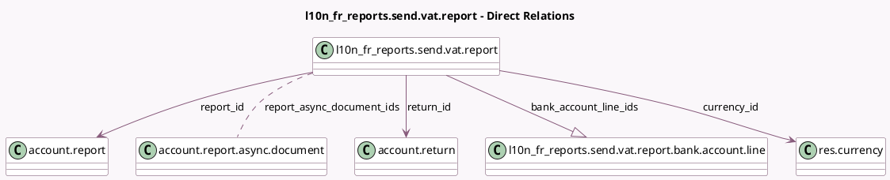

<!-- GENERATED:MODEL -->
---
tags: [odoo, enterprise, generated, model]
---

# l10n_fr_reports.send.vat.report

- Module: [[docs/Enterprise Addons/l10n_fr_reports/l10n_fr_reports|l10n_fr_reports]]
- Scope: Enterprise Addons
- Defined in module: yes
- Source files: `wizard/l10n_fr_send_vat_report.py`
- Python classes: `L10n_Fr_ReportsSendVatReport`
- Description: Send VAT Report Wizard

## Field footprint

- Detected fields: 18
- Field types: `Boolean` x 5, `Date` x 2, `Integer` x 1, `Many2many` x 1, `Many2one` x 3, `Monetary` x 2, `One2many` x 1, `Selection` x 1, `Text` x 2
- Relation fields: 5

## Sample fields

- `bank_account_line_count`: `Integer` (compute `_compute_bank_account_line_count`)
- `bank_account_line_ids`: `One2many` (comodel `l10n_fr_reports.send.vat.report.bank.account.line`)
- `computed_vat_amount`: `Monetary` (compute `_compute_computed_vat_amount`)
- `currency_id`: `Many2one` (comodel `res.currency`)
- `date_from`: `Date`
- `date_to`: `Date`
- `express_mention_reason`: `Text`
- `has_wrongly_configured_account`: `Boolean` (compute `_compute_has_wrongly_configured_account`)
- `is_reimbursement_comment`: `Boolean`
- `is_vat_due`: `Boolean` (compute `_compute_vat_amount`)
- `recipient`: `Selection`
- `reimbursement_comment`: `Text`
- `report_async_document_ids`: `Many2many` (comodel `account.report.async.document`)
- `report_id`: `Many2one` (comodel `account.report`)
- `return_id`: `Many2one` (comodel `account.return`)
- `show_express_mention`: `Boolean`
- `test_interchange`: `Boolean` (comodel `Test Interchange`)
- `vat_amount`: `Monetary` (compute `_compute_vat_amount`)

## Method hints

- Detected methods: 20
- Action methods: none
- Compute methods: `_compute_bank_account_line_count`, `_compute_computed_vat_amount`, `_compute_has_wrongly_configured_account`, `_compute_vat_amount`
- Onchange methods: none

## Direct relation diagram

## Navigation

- **Parent:** [[docs/Enterprise Addons/l10n_fr_reports/Models]]

<!-- GENERATED:MODEL -->
