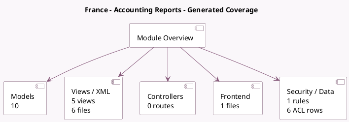

<!-- GENERATED:MODULE -->
---
tags: [odoo, enterprise, module]
---

# France - Accounting Reports

- Scope: Enterprise Addons
- Source: enterprise/l10n_fr_reports
- Dependencies: [[docs/Community Addons/l10n_fr_account/l10n_fr_account|l10n_fr_account]], [[docs/Enterprise Addons/account_reports/account_reports|account_reports]]

## Generated coverage

- Models: 10
- XML files with UI/data artifacts: 6
- Views: 5
- Actions: 2
- Menus: 2
- Rules (ir.rule): 1
- Access CSV entries: 6
- Controller units: 0
- Frontend asset files: 1

## Module map

## Detail notes

- Models: [[docs/Enterprise Addons/l10n_fr_reports/Models|Models]] (10)
- Views and XML: [[docs/Enterprise Addons/l10n_fr_reports/Views|Views]] (6 files)
- Frontend: [[docs/Enterprise Addons/l10n_fr_reports/Frontend|Frontend]] (1 files)

## Key models

- `account.general.ledger.report.handler`
- `account.report.async.document`
- `account.report.async.export`
- `account.return`
- `l10n_fr.fec.export.wizard`
- `l10n_fr.report.handler`
- `l10n_fr_reports.send.vat.report`
- `l10n_fr_reports.send.vat.report.bank.account.line`
- `res.company`
- `res.config.settings`

## Navigation

- [[../Enterprise Addons/Enterprise Addons|Back to scope]]
- [[../../docs/docs|Back to docs]]

<!-- GENERATED:MODULE -->

