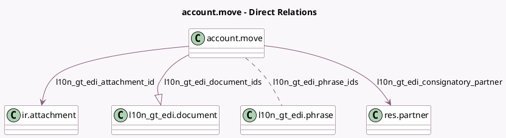

<!-- GENERATED:MODEL -->
---
tags: [odoo, enterprise, generated, model]
---

# account.move

- Module: [[docs/Enterprise Addons/l10n_gt_edi/l10n_gt_edi|l10n_gt_edi]]
- Scope: Enterprise Addons
- Defined in module: extension only
- Source files: `models/account_move.py`
- Python classes: `AccountMove`

## Field footprint

- Detected fields: 8
- Field types: `Boolean` x 1, `Char` x 1, `Many2many` x 1, `Many2one` x 2, `One2many` x 1, `Selection` x 2
- Relation fields: 4

## Sample fields

- `l10n_gt_edi_attachment_id`: `Many2one` (comodel `ir.attachment`, compute `_compute_from_l10n_gt_edi_document_ids`, store `True`)
- `l10n_gt_edi_available_doc_types`: `Char` (compute `_compute_l10n_gt_edi_available_doc_types`)
- `l10n_gt_edi_consignatory_partner`: `Many2one` (comodel `res.partner`, compute `_compute_l10n_gt_edi_consignatory_partner`, store `True`)
- `l10n_gt_edi_doc_type`: `Selection` (compute `_compute_l10n_gt_edi_doc_type`, store `True`)
- `l10n_gt_edi_document_ids`: `One2many` (comodel `l10n_gt_edi.document`)
- `l10n_gt_edi_phrase_ids`: `Many2many` (comodel `l10n_gt_edi.phrase`, compute `_compute_l10n_gt_edi_phrase_ids`, store `True`)
- `l10n_gt_edi_show_consignatory_partner`: `Boolean` (compute `_compute_l10n_gt_edi_show_consignatory_partner`)
- `l10n_gt_edi_state`: `Selection` (compute `_compute_from_l10n_gt_edi_document_ids`, store `True`)

## Method hints

- Detected methods: 22
- Action methods: none
- Compute methods: `_compute_from_l10n_gt_edi_document_ids`, `_compute_l10n_gt_edi_available_doc_types`, `_compute_l10n_gt_edi_consignatory_partner`, `_compute_l10n_gt_edi_doc_type`, `_compute_l10n_gt_edi_phrase_ids`, `_compute_l10n_gt_edi_show_consignatory_partner`, `_compute_show_reset_to_draft_button`
- Onchange methods: none

## Direct relation diagram

## Navigation

- **Parent:** [[docs/Enterprise Addons/l10n_gt_edi/Models]]

<!-- GENERATED:MODEL -->
