<!-- GENERATED:MODEL -->
---
tags: [odoo, enterprise, generated, model]
---

# res.company

- Module: [[docs/Enterprise Addons/l10n_gt_edi/l10n_gt_edi|l10n_gt_edi]]
- Scope: Enterprise Addons
- Defined in module: extension only
- Source files: `models/res_company.py`
- Python classes: `ResCompany`

## Field footprint

- Detected fields: 8
- Field types: `Char` x 5, `Many2many` x 1, `Selection` x 2
- Relation fields: 1

## Sample fields

- `l10n_gt_edi_establishment_code`: `Char` (compute `_compute_l10n_gt_edi_default_fields`, store `True`)
- `l10n_gt_edi_infile_key`: `Char`
- `l10n_gt_edi_infile_token`: `Char`
- `l10n_gt_edi_legal_name`: `Char` (compute `_compute_l10n_gt_edi_default_fields`, store `True`)
- `l10n_gt_edi_phrase_ids`: `Many2many` (related `partner_id.l10n_gt_edi_phrase_ids`)
- `l10n_gt_edi_service_provider`: `Selection` (compute `_compute_l10n_gt_edi_default_fields`, store `True`)
- `l10n_gt_edi_vat_affiliation`: `Selection` (compute `_compute_l10n_gt_edi_default_fields`, store `True`)
- `l10n_gt_edi_ws_prefix`: `Char`

## Method hints

- Detected methods: 2
- Action methods: none
- Compute methods: `_compute_l10n_gt_edi_default_fields`
- Onchange methods: `_onchange_fill_l10n_gt_edi_default_fields`

## Direct relation diagram

```plantuml
@startuml
!define ODOO_COLOR_PRIMARY #714B67
!define ODOO_COLOR_ACCENT #875A7B
!define ODOO_COLOR_BG #FAF7FA

skinparam backgroundColor ODOO_COLOR_BG
skinparam defaultTextAlignment left
skinparam ArrowColor ODOO_COLOR_ACCENT
skinparam ClassBackgroundColor white
skinparam ClassBorderColor ODOO_COLOR_PRIMARY
skinparam ComponentBackgroundColor white
skinparam ComponentBorderColor ODOO_COLOR_PRIMARY
skinparam NoteBackgroundColor #FFF8FF
skinparam NoteBorderColor ODOO_COLOR_ACCENT
skinparam SequenceLifeLineBorderColor ODOO_COLOR_ACCENT
skinparam SequenceLifeLineBackgroundColor #FFFFFF
skinparam SequenceParticipantBorderColor ODOO_COLOR_PRIMARY
skinparam SequenceParticipantBackgroundColor #FFFFFF
skinparam sequence {
  ArrowColor ODOO_COLOR_ACCENT
  ActorBorderColor ODOO_COLOR_PRIMARY
}
title res.company - Direct Relations
class "res.company" as res_company
@enduml
```

## Navigation

- **Parent:** [[docs/Enterprise Addons/l10n_gt_edi/Models]]

<!-- GENERATED:MODEL -->
