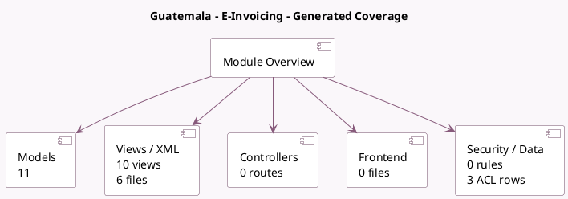

<!-- GENERATED:MODULE -->
---
tags: [odoo, enterprise, module]
---

# Guatemala - E-Invoicing

- Scope: Enterprise Addons
- Source: enterprise/l10n_gt_edi
- Dependencies: [[docs/Community Addons/account_debit_note/account_debit_note|account_debit_note]], [[docs/Community Addons/account_tax_python/account_tax_python|account_tax_python]], [[docs/Community Addons/l10n_gt/l10n_gt|l10n_gt]], [[docs/Community Addons/l10n_latam_base/l10n_latam_base|l10n_latam_base]]

## Generated coverage

- Models: 11
- XML files with UI/data artifacts: 6
- Views: 10
- Actions: 1
- Menus: 1
- Rules (ir.rule): 0
- Access CSV entries: 3
- Controller units: 0
- Frontend asset files: 0

## Module map

## Detail notes

- Models: [[docs/Enterprise Addons/l10n_gt_edi/Models|Models]] (11)
- Views and XML: [[docs/Enterprise Addons/l10n_gt_edi/Views|Views]] (6 files)

## Key models

- `account.chart.template`
- `account.debit.note`
- `account.move`
- `account.move.reversal`
- `account.move.send`
- `account.tax`
- `l10n_gt_edi.document`
- `l10n_gt_edi.phrase`
- `res.company`
- `res.config.settings`
- `res.partner`

## Navigation

- [[../Enterprise Addons/Enterprise Addons|Back to scope]]
- [[../../docs/docs|Back to docs]]

<!-- GENERATED:MODULE -->

