<!-- GENERATED:MODEL -->
---
tags: [odoo, enterprise, generated, model]
---

# hr.employee

- Module: [[docs/Enterprise Addons/l10n_hk_hr_payroll/l10n_hk_hr_payroll|l10n_hk_hr_payroll]]
- Scope: Enterprise Addons
- Defined in module: extension only
- Source files: `models/hr_employee.py`
- Python classes: `HrEmployee`

## Field footprint

- Detected fields: 19
- Field types: `Char` x 12, `Float` x 1, `Integer` x 1, `Many2one` x 1, `Monetary` x 1, `One2many` x 1, `Selection` x 2
- Relation fields: 2

## Sample fields

- `l10n_hk_autopay_account_type`: `Selection`
- `l10n_hk_autopay_email`: `Char`
- `l10n_hk_autopay_mobile`: `Char`
- `l10n_hk_autopay_ref`: `Char`
- `l10n_hk_autopay_svid`: `Char`
- `l10n_hk_given_name`: `Char`
- `l10n_hk_internet`: `Monetary` (related `version_id.l10n_hk_internet`)
- `l10n_hk_mpf_manulife_account`: `Char`
- `l10n_hk_mpf_vc_option`: `Selection` (related `version_id.l10n_hk_mpf_vc_option`)
- `l10n_hk_mpf_vc_percentage`: `Float` (related `version_id.l10n_hk_mpf_vc_percentage`)
- `l10n_hk_name_in_chinese`: `Char`
- `l10n_hk_passport_place_of_issue`: `Char`
- `l10n_hk_rental_id`: `Many2one` (related `version_id.l10n_hk_rental_id`)
- `l10n_hk_rental_ids`: `One2many` (comodel `l10n_hk.rental`)
- `l10n_hk_rentals_count`: `Integer` (compute `_compute_l10n_hk_rentals_count`)
- `l10n_hk_spouse_identification_id`: `Char`
- `l10n_hk_spouse_passport_id`: `Char`
- `l10n_hk_spouse_passport_place_of_issue`: `Char`
- `l10n_hk_surname`: `Char`

## Method hints

- Detected methods: 6
- Action methods: `action_open_rentals`
- Compute methods: `_compute_l10n_hk_rentals_count`, `_compute_legal_name`
- Onchange methods: none

## Direct relation diagram

```plantuml
@startuml
!define ODOO_COLOR_PRIMARY #714B67
!define ODOO_COLOR_ACCENT #875A7B
!define ODOO_COLOR_BG #FAF7FA

skinparam backgroundColor ODOO_COLOR_BG
skinparam defaultTextAlignment left
skinparam ArrowColor ODOO_COLOR_ACCENT
skinparam ClassBackgroundColor white
skinparam ClassBorderColor ODOO_COLOR_PRIMARY
skinparam ComponentBackgroundColor white
skinparam ComponentBorderColor ODOO_COLOR_PRIMARY
skinparam NoteBackgroundColor #FFF8FF
skinparam NoteBorderColor ODOO_COLOR_ACCENT
skinparam SequenceLifeLineBorderColor ODOO_COLOR_ACCENT
skinparam SequenceLifeLineBackgroundColor #FFFFFF
skinparam SequenceParticipantBorderColor ODOO_COLOR_PRIMARY
skinparam SequenceParticipantBackgroundColor #FFFFFF
skinparam sequence {
  ArrowColor ODOO_COLOR_ACCENT
  ActorBorderColor ODOO_COLOR_PRIMARY
}
title hr.employee - Direct Relations
class "hr.employee" as hr_employee
class "l10n_hk.rental" as l10n_hk_rental
hr_employee --|> l10n_hk_rental : l10n_hk_rental_ids
@enduml
```

## Navigation

- **Parent:** [[docs/Enterprise Addons/l10n_hk_hr_payroll/Models]]

<!-- GENERATED:MODEL -->
