<!-- GENERATED:MODEL -->
---
tags: [odoo, enterprise, generated, model]
---

# hr.payslip.run.hsbc.autopay.wizard

- Module: [[docs/Enterprise Addons/l10n_hk_hr_payroll/l10n_hk_hr_payroll|l10n_hk_hr_payroll]]
- Scope: Enterprise Addons
- Defined in module: yes
- Source files: `wizards/hr_payroll_hsbc_autopay_wizard.py`
- Python classes: `HrPayslipRunHsbcAutopayWizard`
- Description: HR Payslip Run HSBC Autopay Wizard

## Field footprint

- Detected fields: 10
- Field types: `Char` x 5, `Date` x 1, `Many2one` x 1, `Selection` x 3
- Relation fields: 1

## Sample fields

- `authorisation_type`: `Selection`
- `autopay_type`: `Selection` (related `company_id.l10n_hk_autopay_type`)
- `batch_type`: `Selection`
- `company_id`: `Many2one` (comodel `res.company`)
- `customer_ref`: `Char`
- `digital_pic_id`: `Char`
- `file_name`: `Char`
- `payment_date`: `Date`
- `payment_set_code`: `Char`
- `ref`: `Char`

## Method hints

- Detected methods: 3
- Action methods: none
- Compute methods: none
- Onchange methods: none

## Direct relation diagram

```plantuml
@startuml
!define ODOO_COLOR_PRIMARY #714B67
!define ODOO_COLOR_ACCENT #875A7B
!define ODOO_COLOR_BG #FAF7FA

skinparam backgroundColor ODOO_COLOR_BG
skinparam defaultTextAlignment left
skinparam ArrowColor ODOO_COLOR_ACCENT
skinparam ClassBackgroundColor white
skinparam ClassBorderColor ODOO_COLOR_PRIMARY
skinparam ComponentBackgroundColor white
skinparam ComponentBorderColor ODOO_COLOR_PRIMARY
skinparam NoteBackgroundColor #FFF8FF
skinparam NoteBorderColor ODOO_COLOR_ACCENT
skinparam SequenceLifeLineBorderColor ODOO_COLOR_ACCENT
skinparam SequenceLifeLineBackgroundColor #FFFFFF
skinparam SequenceParticipantBorderColor ODOO_COLOR_PRIMARY
skinparam SequenceParticipantBackgroundColor #FFFFFF
skinparam sequence {
  ArrowColor ODOO_COLOR_ACCENT
  ActorBorderColor ODOO_COLOR_PRIMARY
}
title hr.payslip.run.hsbc.autopay.wizard - Direct Relations
class "hr.payslip.run.hsbc.autopay.wizard" as hr_payslip_run_hsbc_autopay_wizard
class "res.company" as res_company
hr_payslip_run_hsbc_autopay_wizard --> res_company : company_id
@enduml
```

## Navigation

- **Parent:** [[docs/Enterprise Addons/l10n_hk_hr_payroll/Models]]

<!-- GENERATED:MODEL -->
