<!-- GENERATED:MODEL -->
---
tags: [odoo, enterprise, generated, model]
---

# l10n_hk.ird

- Module: [[docs/Enterprise Addons/l10n_hk_hr_payroll/l10n_hk_hr_payroll|l10n_hk_hr_payroll]]
- Scope: Enterprise Addons
- Defined in module: yes
- Source files: `models/l10n_hk_ird.py`
- Python classes: `L10n_HkIrd`
- Description: IRD Sheet
- Inherits: `hr.payroll.declaration.mixin`

## Field footprint

- Detected fields: 19
- Field types: `Binary` x 1, `Char` x 6, `Date` x 3, `Integer` x 2, `Many2one` x 1, `Selection` x 5, `Text` x 1
- Relation fields: 1

## Sample fields

- `currency_id`: `Many2one` (comodel `res.currency`, related `company_id.currency_id`)
- `designation_of_signer`: `Char` (comodel `Designation of Signer`)
- `display_name`: `Char`
- `end_month`: `Selection`
- `end_period`: `Date` (comodel `End Period`, compute `_compute_period`, store `True`)
- `end_year`: `Integer`
- `error_message`: `Char` (comodel `Error Message`, compute `_compute_validation_state`, store `True`)
- `name_of_signer`: `Char` (comodel `Name of Signer`)
- `pdf_error`: `Text` (comodel `PDF Error Message`)
- `start_month`: `Selection`
- `start_period`: `Date` (comodel `Start Period`, compute `_compute_period`, store `True`)
- `start_year`: `Integer`
- `state`: `Selection`
- `submission_date`: `Date` (comodel `Submission Date`)
- `type_of_form`: `Selection`
- `xml_file`: `Binary`
- `xml_filename`: `Char` (comodel `XML Filename`)
- `xml_validation_state`: `Selection` (compute `_compute_validation_state`, store `True`)
- `year_of_employer_return`: `Char` (comodel `Year of Employer's Return`)

## Method hints

- Detected methods: 16
- Action methods: none
- Compute methods: `_compute_display_name`, `_compute_period`, `_compute_validation_state`
- Onchange methods: none

## Direct relation diagram

```plantuml
@startuml
!define ODOO_COLOR_PRIMARY #714B67
!define ODOO_COLOR_ACCENT #875A7B
!define ODOO_COLOR_BG #FAF7FA

skinparam backgroundColor ODOO_COLOR_BG
skinparam defaultTextAlignment left
skinparam ArrowColor ODOO_COLOR_ACCENT
skinparam ClassBackgroundColor white
skinparam ClassBorderColor ODOO_COLOR_PRIMARY
skinparam ComponentBackgroundColor white
skinparam ComponentBorderColor ODOO_COLOR_PRIMARY
skinparam NoteBackgroundColor #FFF8FF
skinparam NoteBorderColor ODOO_COLOR_ACCENT
skinparam SequenceLifeLineBorderColor ODOO_COLOR_ACCENT
skinparam SequenceLifeLineBackgroundColor #FFFFFF
skinparam SequenceParticipantBorderColor ODOO_COLOR_PRIMARY
skinparam SequenceParticipantBackgroundColor #FFFFFF
skinparam sequence {
  ArrowColor ODOO_COLOR_ACCENT
  ActorBorderColor ODOO_COLOR_PRIMARY
}
title l10n_hk.ird - Direct Relations
class "l10n_hk.ird" as l10n_hk_ird
class "res.currency" as res_currency
l10n_hk_ird --> res_currency : currency_id
@enduml
```

## Navigation

- **Parent:** [[docs/Enterprise Addons/l10n_hk_hr_payroll/Models]]

<!-- GENERATED:MODEL -->
