<!-- GENERATED:MODEL -->
---
tags: [odoo, enterprise, generated, model]
---

# l10n_hk.manulife.mpf.line

- Module: [[docs/Enterprise Addons/l10n_hk_hr_payroll/l10n_hk_hr_payroll|l10n_hk_hr_payroll]]
- Scope: Enterprise Addons
- Defined in module: yes
- Source files: `models/l10n_hk_manulife_mpf.py`
- Python classes: `L10n_HkManulifeMpfLine`
- Description: Manulife MPF Line

## Field footprint

- Detected fields: 5
- Field types: `Float` x 1, `Many2one` x 3, `Monetary` x 1
- Relation fields: 3

## Sample fields

- `amount_surcharge`: `Monetary` (comodel `Amount Surcharge`)
- `currency_id`: `Many2one` (comodel `res.currency`, related `sheet_id.currency_id`)
- `employee_id`: `Many2one` (comodel `hr.employee`)
- `sheet_id`: `Many2one` (comodel `l10n_hk.manulife.mpf`)
- `surcharge_percentage`: `Float` (comodel `Surcharge Percentage`)

## Method hints

- Detected methods: 0
- Action methods: none
- Compute methods: none
- Onchange methods: none

## Direct relation diagram

```plantuml
@startuml
!define ODOO_COLOR_PRIMARY #714B67
!define ODOO_COLOR_ACCENT #875A7B
!define ODOO_COLOR_BG #FAF7FA

skinparam backgroundColor ODOO_COLOR_BG
skinparam defaultTextAlignment left
skinparam ArrowColor ODOO_COLOR_ACCENT
skinparam ClassBackgroundColor white
skinparam ClassBorderColor ODOO_COLOR_PRIMARY
skinparam ComponentBackgroundColor white
skinparam ComponentBorderColor ODOO_COLOR_PRIMARY
skinparam NoteBackgroundColor #FFF8FF
skinparam NoteBorderColor ODOO_COLOR_ACCENT
skinparam SequenceLifeLineBorderColor ODOO_COLOR_ACCENT
skinparam SequenceLifeLineBackgroundColor #FFFFFF
skinparam SequenceParticipantBorderColor ODOO_COLOR_PRIMARY
skinparam SequenceParticipantBackgroundColor #FFFFFF
skinparam sequence {
  ArrowColor ODOO_COLOR_ACCENT
  ActorBorderColor ODOO_COLOR_PRIMARY
}
title l10n_hk.manulife.mpf.line - Direct Relations
class "l10n_hk.manulife.mpf.line" as l10n_hk_manulife_mpf_line
class "hr.employee" as hr_employee
class "l10n_hk.manulife.mpf" as l10n_hk_manulife_mpf
class "res.currency" as res_currency
l10n_hk_manulife_mpf_line --> hr_employee : employee_id
l10n_hk_manulife_mpf_line --> res_currency : currency_id
l10n_hk_manulife_mpf_line --> l10n_hk_manulife_mpf : sheet_id
@enduml
```

## Navigation

- **Parent:** [[docs/Enterprise Addons/l10n_hk_hr_payroll/Models]]

<!-- GENERATED:MODEL -->
