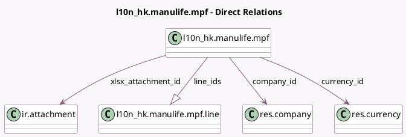

<!-- GENERATED:MODEL -->
---
tags: [odoo, enterprise, generated, model]
---

# l10n_hk.manulife.mpf

- Module: [[docs/Enterprise Addons/l10n_hk_hr_payroll/l10n_hk_hr_payroll|l10n_hk_hr_payroll]]
- Scope: Enterprise Addons
- Defined in module: yes
- Source files: `models/l10n_hk_manulife_mpf.py`
- Python classes: `L10n_HkManulifeMpf`
- Description: Manulife MPF

## Field footprint

- Detected fields: 13
- Field types: `Binary` x 1, `Char` x 5, `Date` x 1, `Integer` x 1, `Many2one` x 3, `One2many` x 1, `Selection` x 1
- Relation fields: 4

## Sample fields

- `cheque_no`: `Char` (comodel `Cheque No.`)
- `company_id`: `Many2one` (comodel `res.company`)
- `currency_id`: `Many2one` (comodel `res.currency`, related `company_id.currency_id`)
- `line_ids`: `One2many` (comodel `l10n_hk.manulife.mpf.line`, compute `_compute_line_ids`, store `True`)
- `manulife_mpf_scheme`: `Char` (comodel `Scheme Number`, related `company_id.l10n_hk_manulife_mpf_scheme`)
- `month`: `Selection`
- `period`: `Date` (comodel `Period`, compute `_compute_period`, store `True`)
- `second_cheque_no`: `Char` (comodel `Second Cheque No.`)
- `sequence_no`: `Char` (comodel `Sequence No.`)
- `xlsx_attachment_id`: `Many2one` (comodel `ir.attachment`)
- `xlsx_file`: `Binary` (comodel `XLSX File`, related `xlsx_attachment_id.datas`)
- `xlsx_filename`: `Char` (comodel `XLSX Filename`, compute `_compute_filename`)
- `year`: `Integer`

## Method hints

- Detected methods: 9
- Action methods: `action_generat_xlsx`
- Compute methods: `_compute_display_name`, `_compute_filename`, `_compute_line_ids`, `_compute_period`
- Onchange methods: none

## Direct relation diagram

## Navigation

- **Parent:** [[docs/Enterprise Addons/l10n_hk_hr_payroll/Models]]

<!-- GENERATED:MODEL -->
