<!-- GENERATED:MODEL -->
---
tags: [odoo, enterprise, generated, model]
---

# l10n_hk.rental

- Module: [[docs/Enterprise Addons/l10n_hk_hr_payroll/l10n_hk_hr_payroll|l10n_hk_hr_payroll]]
- Scope: Enterprise Addons
- Defined in module: yes
- Source files: `models/l10n_hk_rental.py`
- Python classes: `L10n_HkRental`
- Description: Hong Kong: Rental

## Field footprint

- Detected fields: 12
- Field types: `Boolean` x 1, `Char` x 2, `Date` x 2, `Integer` x 1, `Many2one` x 3, `Monetary` x 1, `Selection` x 2
- Relation fields: 3

## Sample fields

- `active`: `Boolean`
- `address`: `Char` (comodel `Address`)
- `amount`: `Monetary` (comodel `Rental Amount`)
- `company_id`: `Many2one` (comodel `res.company`, compute `_compute_company_id`, store `True`)
- `currency_id`: `Many2one` (related `company_id.currency_id`)
- `date_end`: `Date` (comodel `End Date`)
- `date_start`: `Date` (comodel `Start Date`)
- `employee_id`: `Many2one` (comodel `hr.employee`)
- `name`: `Char` (comodel `Rental Reference`)
- `nature`: `Selection`
- `rentals_count`: `Integer` (related `employee_id.l10n_hk_rentals_count`)
- `state`: `Selection`

## Method hints

- Detected methods: 8
- Action methods: `action_open_rentals_list`
- Compute methods: `_compute_company_id`
- Onchange methods: none

## Direct relation diagram

```plantuml
@startuml
!define ODOO_COLOR_PRIMARY #714B67
!define ODOO_COLOR_ACCENT #875A7B
!define ODOO_COLOR_BG #FAF7FA

skinparam backgroundColor ODOO_COLOR_BG
skinparam defaultTextAlignment left
skinparam ArrowColor ODOO_COLOR_ACCENT
skinparam ClassBackgroundColor white
skinparam ClassBorderColor ODOO_COLOR_PRIMARY
skinparam ComponentBackgroundColor white
skinparam ComponentBorderColor ODOO_COLOR_PRIMARY
skinparam NoteBackgroundColor #FFF8FF
skinparam NoteBorderColor ODOO_COLOR_ACCENT
skinparam SequenceLifeLineBorderColor ODOO_COLOR_ACCENT
skinparam SequenceLifeLineBackgroundColor #FFFFFF
skinparam SequenceParticipantBorderColor ODOO_COLOR_PRIMARY
skinparam SequenceParticipantBackgroundColor #FFFFFF
skinparam sequence {
  ArrowColor ODOO_COLOR_ACCENT
  ActorBorderColor ODOO_COLOR_PRIMARY
}
title l10n_hk.rental - Direct Relations
class "l10n_hk.rental" as l10n_hk_rental
class "hr.employee" as hr_employee
class "res.company" as res_company
l10n_hk_rental --> hr_employee : employee_id
l10n_hk_rental --> res_company : company_id
@enduml
```

## Navigation

- **Parent:** [[docs/Enterprise Addons/l10n_hk_hr_payroll/Models]]

<!-- GENERATED:MODEL -->
