<!-- GENERATED:MODEL -->
---
tags: [odoo, enterprise, generated, model]
---

# res.config.settings

- Module: [[docs/Enterprise Addons/l10n_hk_hr_payroll/l10n_hk_hr_payroll|l10n_hk_hr_payroll]]
- Scope: Enterprise Addons
- Defined in module: extension only
- Source files: `models/res_config_settings.py`
- Python classes: `ResConfigSettings`

## Field footprint

- Detected fields: 9
- Field types: `Boolean` x 2, `Char` x 3, `Float` x 1, `Many2one` x 1, `Selection` x 2
- Relation fields: 1

## Sample fields

- `default_l10n_hk_internet`: `Float`
- `l10n_hk_autopay`: `Boolean` (related `company_id.l10n_hk_autopay`)
- `l10n_hk_autopay_partner_bank_id`: `Many2one` (comodel `res.partner.bank`, related `company_id.l10n_hk_autopay_partner_bank_id`)
- `l10n_hk_autopay_type`: `Selection` (related `company_id.l10n_hk_autopay_type`)
- `l10n_hk_employer_file_number`: `Char` (comodel `Employer's File Number`, related `company_id.l10n_hk_employer_file_number`)
- `l10n_hk_employer_name`: `Char` (comodel `Employer's Name shown on reports`, related `company_id.l10n_hk_employer_name`)
- `l10n_hk_eoy_pay_month`: `Selection` (related `company_id.l10n_hk_eoy_pay_month`)
- `l10n_hk_manulife_mpf_scheme`: `Char` (comodel `Manulife MPF Scheme`, related `company_id.l10n_hk_manulife_mpf_scheme`)
- `l10n_hk_use_mpf_offsetting`: `Boolean` (related `company_id.l10n_hk_use_mpf_offsetting`)

## Method hints

- Detected methods: 0
- Action methods: none
- Compute methods: none
- Onchange methods: none

## Direct relation diagram

```plantuml
@startuml
!define ODOO_COLOR_PRIMARY #714B67
!define ODOO_COLOR_ACCENT #875A7B
!define ODOO_COLOR_BG #FAF7FA

skinparam backgroundColor ODOO_COLOR_BG
skinparam defaultTextAlignment left
skinparam ArrowColor ODOO_COLOR_ACCENT
skinparam ClassBackgroundColor white
skinparam ClassBorderColor ODOO_COLOR_PRIMARY
skinparam ComponentBackgroundColor white
skinparam ComponentBorderColor ODOO_COLOR_PRIMARY
skinparam NoteBackgroundColor #FFF8FF
skinparam NoteBorderColor ODOO_COLOR_ACCENT
skinparam SequenceLifeLineBorderColor ODOO_COLOR_ACCENT
skinparam SequenceLifeLineBackgroundColor #FFFFFF
skinparam SequenceParticipantBorderColor ODOO_COLOR_PRIMARY
skinparam SequenceParticipantBackgroundColor #FFFFFF
skinparam sequence {
  ArrowColor ODOO_COLOR_ACCENT
  ActorBorderColor ODOO_COLOR_PRIMARY
}
title res.config.settings - Direct Relations
class "res.config.settings" as res_config_settings
class "res.partner.bank" as res_partner_bank
res_config_settings --> res_partner_bank : l10n_hk_autopay_partner_bank_id
@enduml
```

## Navigation

- **Parent:** [[docs/Enterprise Addons/l10n_hk_hr_payroll/Models]]

<!-- GENERATED:MODEL -->
