<!-- GENERATED:MODEL -->
---
tags: [odoo, enterprise, generated, model]
---

# hr.employee

- Module: [[docs/Enterprise Addons/l10n_hk_hr_payroll_empf/l10n_hk_hr_payroll_empf|l10n_hk_hr_payroll_empf]]
- Scope: Enterprise Addons
- Defined in module: extension only
- Source files: `model/hr_employee.py`
- Python classes: `HrEmployee`

## Field footprint

- Detected fields: 15
- Field types: `Boolean` x 1, `Char` x 2, `Date` x 3, `Integer` x 1, `Many2one` x 6, `Selection` x 2
- Relation fields: 6

## Sample fields

- `l10n_hk_member_class_ct_eevc_id`: `Many2one` (related `version_id.l10n_hk_member_class_ct_eevc_id`)
- `l10n_hk_member_class_ct_ervc2_id`: `Many2one` (related `version_id.l10n_hk_member_class_ct_ervc2_id`)
- `l10n_hk_member_class_ct_ervc_id`: `Many2one` (related `version_id.l10n_hk_member_class_ct_ervc_id`)
- `l10n_hk_member_class_id`: `Many2one` (related `version_id.l10n_hk_member_class_id`)
- `l10n_hk_mpf_account_number`: `Char` (related `version_id.l10n_hk_mpf_account_number`)
- `l10n_hk_mpf_contribution_start`: `Selection` (related `version_id.l10n_hk_mpf_contribution_start`)
- `l10n_hk_mpf_exempt`: `Boolean` (related `version_id.l10n_hk_mpf_exempt`)
- `l10n_hk_mpf_registration_status`: `Selection` (related `version_id.l10n_hk_mpf_registration_status`)
- `l10n_hk_mpf_scheme_id`: `Many2one` (related `version_id.l10n_hk_mpf_scheme_id`)
- `l10n_hk_mpf_scheme_join_date`: `Date` (related `version_id.l10n_hk_mpf_scheme_join_date`)
- `l10n_hk_payroll_group_id`: `Many2one` (related `version_id.l10n_hk_payroll_group_id`)
- `l10n_hk_previous_employment_date`: `Date`
- `l10n_hk_scheme_group_count`: `Integer` (related `version_id.l10n_hk_scheme_group_count`)
- `l10n_hk_staff_number`: `Char` (related `version_id.l10n_hk_staff_number`)
- `l10n_hk_visa_issue_date`: `Date`

## Method hints

- Detected methods: 0
- Action methods: none
- Compute methods: none
- Onchange methods: none

## Direct relation diagram

```plantuml
@startuml
!define ODOO_COLOR_PRIMARY #714B67
!define ODOO_COLOR_ACCENT #875A7B
!define ODOO_COLOR_BG #FAF7FA

skinparam backgroundColor ODOO_COLOR_BG
skinparam defaultTextAlignment left
skinparam ArrowColor ODOO_COLOR_ACCENT
skinparam ClassBackgroundColor white
skinparam ClassBorderColor ODOO_COLOR_PRIMARY
skinparam ComponentBackgroundColor white
skinparam ComponentBorderColor ODOO_COLOR_PRIMARY
skinparam NoteBackgroundColor #FFF8FF
skinparam NoteBorderColor ODOO_COLOR_ACCENT
skinparam SequenceLifeLineBorderColor ODOO_COLOR_ACCENT
skinparam SequenceLifeLineBackgroundColor #FFFFFF
skinparam SequenceParticipantBorderColor ODOO_COLOR_PRIMARY
skinparam SequenceParticipantBackgroundColor #FFFFFF
skinparam sequence {
  ArrowColor ODOO_COLOR_ACCENT
  ActorBorderColor ODOO_COLOR_PRIMARY
}
title hr.employee - Direct Relations
class "hr.employee" as hr_employee
@enduml
```

## Navigation

- **Parent:** [[docs/Enterprise Addons/l10n_hk_hr_payroll_empf/Models]]

<!-- GENERATED:MODEL -->
