<!-- GENERATED:MODEL -->
---
tags: [odoo, enterprise, generated, model]
---

# hr.payslip

- Module: [[docs/Enterprise Addons/l10n_hk_hr_payroll_empf/l10n_hk_hr_payroll_empf|l10n_hk_hr_payroll_empf]]
- Scope: Enterprise Addons
- Defined in module: extension only
- Source files: `model/hr_payslip.py`
- Python classes: `HrPayslip`

## Field footprint

- Detected fields: 2
- Field types: `Many2one` x 1, `One2many` x 1
- Relation fields: 2

## Sample fields

- `l10n_hk_contribution_line_id`: `One2many` (comodel `l10n_hk.empf.contribution.report.line`)
- `l10n_hk_version_scheme_id`: `Many2one` (related `version_id.l10n_hk_mpf_scheme_id`)

## Method hints

- Detected methods: 3
- Action methods: `action_payslip_cancel`, `action_payslip_draft`
- Compute methods: none
- Onchange methods: none

## Direct relation diagram

```plantuml
@startuml
!define ODOO_COLOR_PRIMARY #714B67
!define ODOO_COLOR_ACCENT #875A7B
!define ODOO_COLOR_BG #FAF7FA

skinparam backgroundColor ODOO_COLOR_BG
skinparam defaultTextAlignment left
skinparam ArrowColor ODOO_COLOR_ACCENT
skinparam ClassBackgroundColor white
skinparam ClassBorderColor ODOO_COLOR_PRIMARY
skinparam ComponentBackgroundColor white
skinparam ComponentBorderColor ODOO_COLOR_PRIMARY
skinparam NoteBackgroundColor #FFF8FF
skinparam NoteBorderColor ODOO_COLOR_ACCENT
skinparam SequenceLifeLineBorderColor ODOO_COLOR_ACCENT
skinparam SequenceLifeLineBackgroundColor #FFFFFF
skinparam SequenceParticipantBorderColor ODOO_COLOR_PRIMARY
skinparam SequenceParticipantBackgroundColor #FFFFFF
skinparam sequence {
  ArrowColor ODOO_COLOR_ACCENT
  ActorBorderColor ODOO_COLOR_PRIMARY
}
title hr.payslip - Direct Relations
class "hr.payslip" as hr_payslip
class "l10n_hk.empf.contribution.report.line" as l10n_hk_empf_contribution_report_line
hr_payslip --|> l10n_hk_empf_contribution_report_line : l10n_hk_contribution_line_id
@enduml
```

## Navigation

- **Parent:** [[docs/Enterprise Addons/l10n_hk_hr_payroll_empf/Models]]

<!-- GENERATED:MODEL -->
