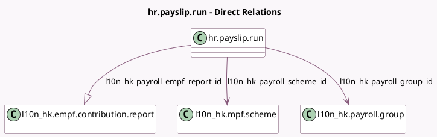

<!-- GENERATED:MODEL -->
---
tags: [odoo, enterprise, generated, model]
---

# hr.payslip.run

- Module: [[docs/Enterprise Addons/l10n_hk_hr_payroll_empf/l10n_hk_hr_payroll_empf|l10n_hk_hr_payroll_empf]]
- Scope: Enterprise Addons
- Defined in module: extension only
- Source files: `model/hr_payslip_run.py`
- Python classes: `HrPayslipRun`

## Field footprint

- Detected fields: 3
- Field types: `Many2one` x 2, `One2many` x 1
- Relation fields: 3

## Sample fields

- `l10n_hk_payroll_empf_report_id`: `One2many` (comodel `l10n_hk.empf.contribution.report`)
- `l10n_hk_payroll_group_id`: `Many2one` (comodel `l10n_hk.payroll.group`)
- `l10n_hk_payroll_scheme_id`: `Many2one` (comodel `l10n_hk.mpf.scheme`)

## Method hints

- Detected methods: 4
- Action methods: `action_l10n_hk_hr_version_list_view_payrun`, `action_open_empf_contribution_report`, `action_validate`
- Compute methods: none
- Onchange methods: none

## Direct relation diagram

## Navigation

- **Parent:** [[docs/Enterprise Addons/l10n_hk_hr_payroll_empf/Models]]

<!-- GENERATED:MODEL -->
