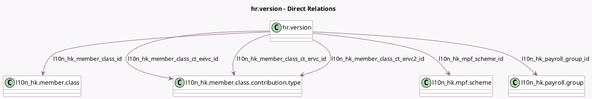

<!-- GENERATED:MODEL -->
---
tags: [odoo, enterprise, generated, model]
---

# hr.version

- Module: [[docs/Enterprise Addons/l10n_hk_hr_payroll_empf/l10n_hk_hr_payroll_empf|l10n_hk_hr_payroll_empf]]
- Scope: Enterprise Addons
- Defined in module: extension only
- Source files: `model/hr_version.py`
- Python classes: `HrVersion`

## Field footprint

- Detected fields: 13
- Field types: `Boolean` x 1, `Char` x 2, `Date` x 1, `Integer` x 1, `Many2one` x 6, `Selection` x 2
- Relation fields: 6

## Sample fields

- `l10n_hk_member_class_ct_eevc_id`: `Many2one` (comodel `l10n_hk.member.class.contribution.type`, compute `_compute_employee_member_class_contribution_types`)
- `l10n_hk_member_class_ct_ervc2_id`: `Many2one` (comodel `l10n_hk.member.class.contribution.type`, compute `_compute_employee_member_class_contribution_types`)
- `l10n_hk_member_class_ct_ervc_id`: `Many2one` (comodel `l10n_hk.member.class.contribution.type`, compute `_compute_employee_member_class_contribution_types`)
- `l10n_hk_member_class_id`: `Many2one` (comodel `l10n_hk.member.class`, compute `_compute_l10n_hk_member_class`, store `True`)
- `l10n_hk_mpf_account_number`: `Char`
- `l10n_hk_mpf_contribution_start`: `Selection`
- `l10n_hk_mpf_exempt`: `Boolean`
- `l10n_hk_mpf_registration_status`: `Selection`
- `l10n_hk_mpf_scheme_id`: `Many2one` (comodel `l10n_hk.mpf.scheme`)
- `l10n_hk_mpf_scheme_join_date`: `Date`
- `l10n_hk_payroll_group_id`: `Many2one` (comodel `l10n_hk.payroll.group`, compute `_compute_l10n_hk_payroll_group`, store `True`)
- `l10n_hk_scheme_group_count`: `Integer` (compute `_compute_l10n_hk_scheme_group_count`)
- `l10n_hk_staff_number`: `Char`

## Method hints

- Detected methods: 6
- Action methods: none
- Compute methods: `_compute_employee_member_class_contribution_types`, `_compute_l10n_hk_member_class`, `_compute_l10n_hk_payroll_group`, `_compute_l10n_hk_scheme_group_count`
- Onchange methods: none

## Direct relation diagram

## Navigation

- **Parent:** [[docs/Enterprise Addons/l10n_hk_hr_payroll_empf/Models]]

<!-- GENERATED:MODEL -->
