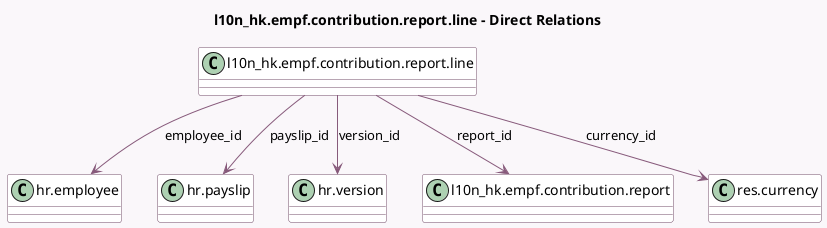

<!-- GENERATED:MODEL -->
---
tags: [odoo, enterprise, generated, model]
---

# l10n_hk.empf.contribution.report.line

- Module: [[docs/Enterprise Addons/l10n_hk_hr_payroll_empf/l10n_hk_hr_payroll_empf|l10n_hk_hr_payroll_empf]]
- Scope: Enterprise Addons
- Defined in module: yes
- Source files: `model/l10n_hk_empf_contribution_report_line.py`
- Python classes: `L10n_HkEMpfContributionReportLine`
- Description: eMPF contribution report line

## Field footprint

- Detected fields: 25
- Field types: `Char` x 2, `Date` x 4, `Many2one` x 7, `Monetary` x 10, `Selection` x 2
- Relation fields: 7

## Sample fields

- `basic_salary`: `Monetary` (compute `_compute_amounts`, store `True`)
- `company_id`: `Many2one` (related `report_id.company_id`, store `True`)
- `contribution_end_date`: `Date` (related `payslip_id.date_to`, store `True`)
- `contribution_start_date`: `Date` (related `payslip_id.date_from`, store `True`)
- `currency_id`: `Many2one` (comodel `res.currency`, related `company_id.currency_id`)
- `eemc`: `Monetary` (compute `_compute_amounts`, store `True`)
- `eevc`: `Monetary` (compute `_compute_amounts`, store `True`)
- `employee_id`: `Many2one` (comodel `hr.employee`, related `payslip_id.employee_id`, store `True`)
- `employee_surcharge`: `Monetary`
- `employer_surcharge`: `Monetary`
- `ermc`: `Monetary` (compute `_compute_amounts`, store `True`)
- `errors`: `Char`
- `ervc`: `Monetary` (compute `_compute_amounts`, store `True`)
- `ervc_2`: `Monetary` (compute `_compute_amounts`, store `True`)
- `mpf_account_number`: `Char` (related `version_id.l10n_hk_mpf_account_number`)
- `payslip_id`: `Many2one` (comodel `hr.payslip`)
- `relevant_income`: `Monetary` (compute `_compute_amounts`, store `True`)
- `report_contribution_end_date`: `Date` (related `report_id.contribution_period_end`)
- `report_contribution_start_date`: `Date` (related `report_id.contribution_period_start`)
- `report_id`: `Many2one` (comodel `l10n_hk.empf.contribution.report`)

## Method hints

- Detected methods: 6
- Action methods: `action_display_errors`
- Compute methods: `_compute_amounts`, `_compute_termination_payment_type`, `_compute_total`, `_compute_version_id`
- Onchange methods: none

## Direct relation diagram

## Navigation

- **Parent:** [[docs/Enterprise Addons/l10n_hk_hr_payroll_empf/Models]]

<!-- GENERATED:MODEL -->
