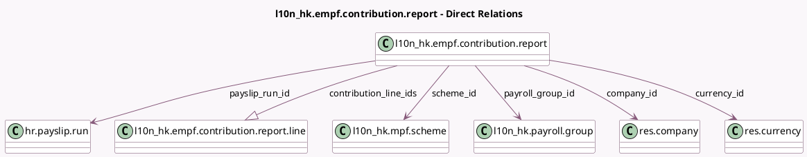

<!-- GENERATED:MODEL -->
---
tags: [odoo, enterprise, generated, model]
---

# l10n_hk.empf.contribution.report

- Module: [[docs/Enterprise Addons/l10n_hk_hr_payroll_empf/l10n_hk_hr_payroll_empf|l10n_hk_hr_payroll_empf]]
- Scope: Enterprise Addons
- Defined in module: yes
- Source files: `model/l10n_hk_empf_contribution_report.py`
- Python classes: `L10n_HkEMpfContributionReport`
- Description: eMPF contribution report
- Inherits: `mail.activity.mixin`, `mail.thread`

## Field footprint

- Detected fields: 12
- Field types: `Char` x 1, `Date` x 2, `Many2one` x 7, `One2many` x 1, `Selection` x 1
- Relation fields: 8

## Sample fields

- `company_id`: `Many2one` (comodel `res.company`)
- `contribution_line_ids`: `One2many` (comodel `l10n_hk.empf.contribution.report.line`, compute `_compute_contribution_lines`, store `True`)
- `contribution_period_end`: `Date` (compute `_compute_period`, store `True`)
- `contribution_period_start`: `Date` (compute `_compute_period`, store `True`)
- `currency_id`: `Many2one` (comodel `res.currency`, related `company_id.currency_id`)
- `name`: `Char` (compute `_compute_name`, store `True`)
- `payroll_group_id`: `Many2one` (comodel `l10n_hk.payroll.group`, compute `_compute_scheme_details`, store `True`)
- `payslip_run_group_id`: `Many2one` (related `payslip_run_id.l10n_hk_payroll_group_id`)
- `payslip_run_id`: `Many2one` (comodel `hr.payslip.run`)
- `payslip_run_scheme_id`: `Many2one` (related `payslip_run_id.l10n_hk_payroll_scheme_id`)
- `scheme_id`: `Many2one` (comodel `l10n_hk.mpf.scheme`, compute `_compute_scheme_details`, store `True`)
- `state`: `Selection`

## Method hints

- Detected methods: 21
- Action methods: `action_draft`, `action_generate_report`, `action_recompute_contribution_lines`, `action_validate`
- Compute methods: `_compute_contribution_lines`, `_compute_name`, `_compute_period`, `_compute_scheme_details`
- Onchange methods: none

## Direct relation diagram

## Navigation

- **Parent:** [[docs/Enterprise Addons/l10n_hk_hr_payroll_empf/Models]]

<!-- GENERATED:MODEL -->
