<!-- GENERATED:MODEL -->
---
tags: [odoo, enterprise, generated, model]
---

# l10n_hk.member.class.contribution.type

- Module: [[docs/Enterprise Addons/l10n_hk_hr_payroll_empf/l10n_hk_hr_payroll_empf|l10n_hk_hr_payroll_empf]]
- Scope: Enterprise Addons
- Defined in module: yes
- Source files: `model/member_class_contribution_type.py`
- Python classes: `l10n_hkMemberClassContributionType`
- Description: Hong Kong: Member Class Contribution Type

## Field footprint

- Detected fields: 6
- Field types: `Float` x 1, `Many2one` x 2, `Selection` x 3
- Relation fields: 2

## Sample fields

- `amount`: `Float` (compute `_compute_amount`, store `True`)
- `company_id`: `Many2one` (related `member_class_id.company_id`, store `True`)
- `contribution_option`: `Selection`
- `contribution_type`: `Selection`
- `definition_of_income`: `Selection` (compute `_compute_definition_of_income`, store `True`)
- `member_class_id`: `Many2one` (comodel `l10n_hk.member.class`)

## Method hints

- Detected methods: 3
- Action methods: none
- Compute methods: `_compute_amount`, `_compute_definition_of_income`
- Onchange methods: none

## Direct relation diagram

```plantuml
@startuml
!define ODOO_COLOR_PRIMARY #714B67
!define ODOO_COLOR_ACCENT #875A7B
!define ODOO_COLOR_BG #FAF7FA

skinparam backgroundColor ODOO_COLOR_BG
skinparam defaultTextAlignment left
skinparam ArrowColor ODOO_COLOR_ACCENT
skinparam ClassBackgroundColor white
skinparam ClassBorderColor ODOO_COLOR_PRIMARY
skinparam ComponentBackgroundColor white
skinparam ComponentBorderColor ODOO_COLOR_PRIMARY
skinparam NoteBackgroundColor #FFF8FF
skinparam NoteBorderColor ODOO_COLOR_ACCENT
skinparam SequenceLifeLineBorderColor ODOO_COLOR_ACCENT
skinparam SequenceLifeLineBackgroundColor #FFFFFF
skinparam SequenceParticipantBorderColor ODOO_COLOR_PRIMARY
skinparam SequenceParticipantBackgroundColor #FFFFFF
skinparam sequence {
  ArrowColor ODOO_COLOR_ACCENT
  ActorBorderColor ODOO_COLOR_PRIMARY
}
title l10n_hk.member.class.contribution.type - Direct Relations
class "l10n_hk.member.class.contribution.type" as l10n_hk_member_class_contribution_type
class "l10n_hk.member.class" as l10n_hk_member_class
l10n_hk_member_class_contribution_type --> l10n_hk_member_class : member_class_id
@enduml
```

## Navigation

- **Parent:** [[docs/Enterprise Addons/l10n_hk_hr_payroll_empf/Models]]

<!-- GENERATED:MODEL -->
