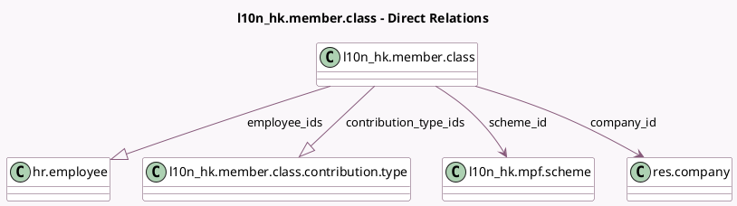

<!-- GENERATED:MODEL -->
---
tags: [odoo, enterprise, generated, model]
---

# l10n_hk.member.class

- Module: [[docs/Enterprise Addons/l10n_hk_hr_payroll_empf/l10n_hk_hr_payroll_empf|l10n_hk_hr_payroll_empf]]
- Scope: Enterprise Addons
- Defined in module: yes
- Source files: `model/member_class.py`
- Python classes: `l10n_hkMemberClass`
- Description: Hong Kong: Member Class

## Field footprint

- Detected fields: 7
- Field types: `Boolean` x 1, `Char` x 1, `Many2one` x 2, `One2many` x 2, `Selection` x 1
- Relation fields: 4

## Sample fields

- `company_id`: `Many2one` (comodel `res.company`)
- `contribution_type_ids`: `One2many` (comodel `l10n_hk.member.class.contribution.type`)
- `definition_of_service`: `Selection`
- `employee_ids`: `One2many` (comodel `hr.employee`)
- `is_default`: `Boolean`
- `name`: `Char`
- `scheme_id`: `Many2one` (comodel `l10n_hk.mpf.scheme`)

## Method hints

- Detected methods: 3
- Action methods: `action_open_employee_list`
- Compute methods: none
- Onchange methods: none

## Direct relation diagram

## Navigation

- **Parent:** [[docs/Enterprise Addons/l10n_hk_hr_payroll_empf/Models]]

<!-- GENERATED:MODEL -->
