<!-- GENERATED:MODEL -->
---
tags: [odoo, enterprise, generated, model]
---

# l10n_hk.mpf.scheme

- Module: [[docs/Enterprise Addons/l10n_hk_hr_payroll_empf/l10n_hk_hr_payroll_empf|l10n_hk_hr_payroll_empf]]
- Scope: Enterprise Addons
- Defined in module: yes
- Source files: `model/mpf_scheme.py`
- Python classes: `l10n_hkMpfScheme`
- Description: Hong Kong: MPF Scheme

## Field footprint

- Detected fields: 5
- Field types: `Char` x 3, `One2many` x 2
- Relation fields: 2

## Sample fields

- `employer_account_number`: `Char`
- `member_class_ids`: `One2many` (comodel `l10n_hk.member.class`)
- `name`: `Char`
- `payroll_group_ids`: `One2many` (comodel `l10n_hk.payroll.group`)
- `registration_number`: `Char`

## Method hints

- Detected methods: 2
- Action methods: none
- Compute methods: `_compute_display_name`
- Onchange methods: none

## Direct relation diagram

```plantuml
@startuml
!define ODOO_COLOR_PRIMARY #714B67
!define ODOO_COLOR_ACCENT #875A7B
!define ODOO_COLOR_BG #FAF7FA

skinparam backgroundColor ODOO_COLOR_BG
skinparam defaultTextAlignment left
skinparam ArrowColor ODOO_COLOR_ACCENT
skinparam ClassBackgroundColor white
skinparam ClassBorderColor ODOO_COLOR_PRIMARY
skinparam ComponentBackgroundColor white
skinparam ComponentBorderColor ODOO_COLOR_PRIMARY
skinparam NoteBackgroundColor #FFF8FF
skinparam NoteBorderColor ODOO_COLOR_ACCENT
skinparam SequenceLifeLineBorderColor ODOO_COLOR_ACCENT
skinparam SequenceLifeLineBackgroundColor #FFFFFF
skinparam SequenceParticipantBorderColor ODOO_COLOR_PRIMARY
skinparam SequenceParticipantBackgroundColor #FFFFFF
skinparam sequence {
  ArrowColor ODOO_COLOR_ACCENT
  ActorBorderColor ODOO_COLOR_PRIMARY
}
title l10n_hk.mpf.scheme - Direct Relations
class "l10n_hk.mpf.scheme" as l10n_hk_mpf_scheme
class "l10n_hk.member.class" as l10n_hk_member_class
class "l10n_hk.payroll.group" as l10n_hk_payroll_group
l10n_hk_mpf_scheme --|> l10n_hk_payroll_group : payroll_group_ids
l10n_hk_mpf_scheme --|> l10n_hk_member_class : member_class_ids
@enduml
```

## Navigation

- **Parent:** [[docs/Enterprise Addons/l10n_hk_hr_payroll_empf/Models]]

<!-- GENERATED:MODEL -->
