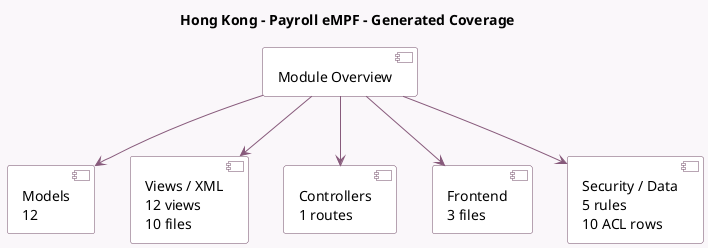

<!-- GENERATED:MODULE -->
---
tags: [odoo, enterprise, module]
---

# Hong Kong - Payroll eMPF

- Scope: Enterprise Addons
- Source: enterprise/l10n_hk_hr_payroll_empf
- Dependencies: [[docs/Enterprise Addons/l10n_hk_hr_payroll/l10n_hk_hr_payroll|l10n_hk_hr_payroll]]

## Generated coverage

- Models: 12
- XML files with UI/data artifacts: 10
- Views: 12
- Actions: 3
- Menus: 3
- Rules (ir.rule): 5
- Access CSV entries: 10
- Controller units: 1
- Frontend asset files: 3

## Module map

## Detail notes

- Models: [[docs/Enterprise Addons/l10n_hk_hr_payroll_empf/Models|Models]] (12)
- Views and XML: [[docs/Enterprise Addons/l10n_hk_hr_payroll_empf/Views|Views]] (10 files)
- Controllers: [[docs/Enterprise Addons/l10n_hk_hr_payroll_empf/Controllers|Controllers]] (1)
- Frontend: [[docs/Enterprise Addons/l10n_hk_hr_payroll_empf/Frontend|Frontend]] (3 files)

## Key models

- `hr.departure.reason`
- `hr.employee`
- `hr.payslip`
- `hr.payslip.run`
- `hr.version`
- `l10n_hk.empf.contribution.report`
- `l10n_hk.empf.contribution.report.line`
- `l10n_hk.member.class`
- `l10n_hk.member.class.contribution.type`
- `l10n_hk.mpf.scheme`
- `l10n_hk.payroll.group`
- `res.config.settings`

## Navigation

- [[../Enterprise Addons/Enterprise Addons|Back to scope]]
- [[../../docs/docs|Back to docs]]

<!-- GENERATED:MODULE -->

