<!-- GENERATED:MODEL -->
---
tags: [odoo, enterprise, generated, model]
---

# hr.employee

- Module: [[docs/Enterprise Addons/l10n_in_hr_payroll/l10n_in_hr_payroll|l10n_in_hr_payroll]]
- Scope: Enterprise Addons
- Defined in module: extension only
- Source files: `models/hr_employee.py`
- Python classes: `HrEmployee`

## Field footprint

- Detected fields: 44
- Field types: `Boolean` x 4, `Char` x 5, `Float` x 12, `Integer` x 1, `Many2one` x 1, `Monetary` x 19, `Selection` x 2
- Relation fields: 1

## Sample fields

- `l10n_in_basic_percentage`: `Float` (related `version_id.l10n_in_basic_percentage`)
- `l10n_in_basic_salary_amount`: `Monetary` (related `version_id.l10n_in_basic_salary_amount`)
- `l10n_in_company_transport`: `Monetary` (related `version_id.l10n_in_company_transport`)
- `l10n_in_esic_employee_amount`: `Monetary` (related `version_id.l10n_in_esic_employee_amount`)
- `l10n_in_esic_employee_percentage`: `Float` (related `version_id.l10n_in_esic_employee_percentage`)
- `l10n_in_esic_employer_amount`: `Monetary` (related `version_id.l10n_in_esic_employer_amount`)
- `l10n_in_esic_employer_percentage`: `Float` (related `version_id.l10n_in_esic_employer_percentage`)
- `l10n_in_esic_number`: `Char`
- `l10n_in_fixed_allowance`: `Monetary` (related `version_id.l10n_in_fixed_allowance`)
- `l10n_in_fixed_allowance_percentage`: `Float` (related `version_id.l10n_in_fixed_allowance_percentage`)
- `l10n_in_gratuity`: `Monetary` (related `version_id.l10n_in_gratuity`)
- `l10n_in_gratuity_percentage`: `Float` (related `version_id.l10n_in_gratuity_percentage`)
- `l10n_in_hra`: `Monetary` (related `version_id.l10n_in_hra`)
- `l10n_in_hra_percentage`: `Float` (related `version_id.l10n_in_hra_percentage`)
- `l10n_in_insured_first_children`: `Boolean` (related `version_id.l10n_in_insured_first_children`)
- `l10n_in_insured_second_children`: `Boolean` (related `version_id.l10n_in_insured_second_children`)
- `l10n_in_insured_spouse`: `Boolean` (related `version_id.l10n_in_insured_spouse`)
- `l10n_in_internet_subscription`: `Monetary` (related `version_id.l10n_in_internet_subscription`)
- `l10n_in_leave_travel_allowance`: `Monetary` (related `version_id.l10n_in_leave_travel_allowance`)
- `l10n_in_leave_travel_percentage`: `Float` (related `version_id.l10n_in_leave_travel_percentage`)

## Method hints

- Detected methods: 2
- Action methods: none
- Compute methods: none
- Onchange methods: none

## Direct relation diagram

```plantuml
@startuml
!define ODOO_COLOR_PRIMARY #714B67
!define ODOO_COLOR_ACCENT #875A7B
!define ODOO_COLOR_BG #FAF7FA

skinparam backgroundColor ODOO_COLOR_BG
skinparam defaultTextAlignment left
skinparam ArrowColor ODOO_COLOR_ACCENT
skinparam ClassBackgroundColor white
skinparam ClassBorderColor ODOO_COLOR_PRIMARY
skinparam ComponentBackgroundColor white
skinparam ComponentBorderColor ODOO_COLOR_PRIMARY
skinparam NoteBackgroundColor #FFF8FF
skinparam NoteBorderColor ODOO_COLOR_ACCENT
skinparam SequenceLifeLineBorderColor ODOO_COLOR_ACCENT
skinparam SequenceLifeLineBackgroundColor #FFFFFF
skinparam SequenceParticipantBorderColor ODOO_COLOR_PRIMARY
skinparam SequenceParticipantBackgroundColor #FFFFFF
skinparam sequence {
  ArrowColor ODOO_COLOR_ACCENT
  ActorBorderColor ODOO_COLOR_PRIMARY
}
title hr.employee - Direct Relations
class "hr.employee" as hr_employee
@enduml
```

## Navigation

- **Parent:** [[docs/Enterprise Addons/l10n_in_hr_payroll/Models]]

<!-- GENERATED:MODEL -->
