<!-- GENERATED:MODEL -->
---
tags: [odoo, enterprise, generated, model]
---

# hr.payroll.payment.report.wizard

- Module: [[docs/Enterprise Addons/l10n_in_hr_payroll/l10n_in_hr_payroll|l10n_in_hr_payroll]]
- Scope: Enterprise Addons
- Defined in module: extension only
- Source files: `wizard/hr_payroll_payment_report_wizard.py`
- Python classes: `HrPayrollPaymentReportWizard`

## Field footprint

- Detected fields: 14
- Field types: `Binary` x 2, `Boolean` x 3, `Char` x 4, `Date` x 2, `Many2many` x 1, `Many2one` x 1, `Selection` x 1
- Relation fields: 2

## Sample fields

- `export_format`: `Selection`
- `l10n_in_cheque_date`: `Date`
- `l10n_in_cheque_number`: `Char`
- `l10n_in_company_bank_id`: `Many2one` (comodel `res.partner.bank`)
- `l10n_in_effective_from`: `Date`
- `l10n_in_neft`: `Boolean`
- `l10n_in_payment_advice_filename_pdf`: `Char`
- `l10n_in_payment_advice_filename_xlsx`: `Char`
- `l10n_in_payment_advice_pdf`: `Binary` (comodel `Payment Advice PDF`)
- `l10n_in_payment_advice_xlsx`: `Binary` (comodel `Payment Advice XLSX`)
- `l10n_in_reference`: `Char`
- `l10n_in_state_pdf`: `Boolean`
- `l10n_in_state_xlsx`: `Boolean`
- `l10n_in_valid_bank_accounts_ids`: `Many2many` (comodel `res.partner.bank`, compute `_compute_bank_account_ids`)

## Method hints

- Detected methods: 8
- Action methods: none
- Compute methods: `_compute_bank_account_ids`
- Onchange methods: none

## Direct relation diagram

```plantuml
@startuml
!define ODOO_COLOR_PRIMARY #714B67
!define ODOO_COLOR_ACCENT #875A7B
!define ODOO_COLOR_BG #FAF7FA

skinparam backgroundColor ODOO_COLOR_BG
skinparam defaultTextAlignment left
skinparam ArrowColor ODOO_COLOR_ACCENT
skinparam ClassBackgroundColor white
skinparam ClassBorderColor ODOO_COLOR_PRIMARY
skinparam ComponentBackgroundColor white
skinparam ComponentBorderColor ODOO_COLOR_PRIMARY
skinparam NoteBackgroundColor #FFF8FF
skinparam NoteBorderColor ODOO_COLOR_ACCENT
skinparam SequenceLifeLineBorderColor ODOO_COLOR_ACCENT
skinparam SequenceLifeLineBackgroundColor #FFFFFF
skinparam SequenceParticipantBorderColor ODOO_COLOR_PRIMARY
skinparam SequenceParticipantBackgroundColor #FFFFFF
skinparam sequence {
  ArrowColor ODOO_COLOR_ACCENT
  ActorBorderColor ODOO_COLOR_PRIMARY
}
title hr.payroll.payment.report.wizard - Direct Relations
class "hr.payroll.payment.report.wizard" as hr_payroll_payment_report_wizard
class "res.partner.bank" as res_partner_bank
hr_payroll_payment_report_wizard .. res_partner_bank : l10n_in_valid_bank_accounts_ids
hr_payroll_payment_report_wizard --> res_partner_bank : l10n_in_company_bank_id
@enduml
```

## Navigation

- **Parent:** [[docs/Enterprise Addons/l10n_in_hr_payroll/Models]]

<!-- GENERATED:MODEL -->
