<!-- GENERATED:MODEL -->
---
tags: [odoo, enterprise, generated, model]
---

# l10n.in.hr.payroll.epf.report

- Module: [[docs/Enterprise Addons/l10n_in_hr_payroll/l10n_in_hr_payroll|l10n_in_hr_payroll]]
- Scope: Enterprise Addons
- Defined in module: yes
- Source files: `report/report_hr_epf.py`
- Python classes: `L10nInHrPayrollEpfReport`
- Description: Indian Payroll: Employee Provident Fund Report

## Field footprint

- Detected fields: 5
- Field types: `Binary` x 1, `Char` x 1, `Integer` x 1, `Many2one` x 1, `Selection` x 1
- Relation fields: 1

## Sample fields

- `company_id`: `Many2one` (comodel `res.company`)
- `month`: `Selection`
- `xls_file`: `Binary`
- `xls_filename`: `Char`
- `year`: `Integer`

## Method hints

- Detected methods: 4
- Action methods: `action_export_xlsx`
- Compute methods: `_compute_display_name`
- Onchange methods: none

## Direct relation diagram

```plantuml
@startuml
!define ODOO_COLOR_PRIMARY #714B67
!define ODOO_COLOR_ACCENT #875A7B
!define ODOO_COLOR_BG #FAF7FA

skinparam backgroundColor ODOO_COLOR_BG
skinparam defaultTextAlignment left
skinparam ArrowColor ODOO_COLOR_ACCENT
skinparam ClassBackgroundColor white
skinparam ClassBorderColor ODOO_COLOR_PRIMARY
skinparam ComponentBackgroundColor white
skinparam ComponentBorderColor ODOO_COLOR_PRIMARY
skinparam NoteBackgroundColor #FFF8FF
skinparam NoteBorderColor ODOO_COLOR_ACCENT
skinparam SequenceLifeLineBorderColor ODOO_COLOR_ACCENT
skinparam SequenceLifeLineBackgroundColor #FFFFFF
skinparam SequenceParticipantBorderColor ODOO_COLOR_PRIMARY
skinparam SequenceParticipantBackgroundColor #FFFFFF
skinparam sequence {
  ArrowColor ODOO_COLOR_ACCENT
  ActorBorderColor ODOO_COLOR_PRIMARY
}
title l10n.in.hr.payroll.epf.report - Direct Relations
class "l10n.in.hr.payroll.epf.report" as l10n_in_hr_payroll_epf_report
class "res.company" as res_company
l10n_in_hr_payroll_epf_report --> res_company : company_id
@enduml
```

## Navigation

- **Parent:** [[docs/Enterprise Addons/l10n_in_hr_payroll/Models]]

<!-- GENERATED:MODEL -->
