<!-- GENERATED:MODEL -->
---
tags: [odoo, enterprise, generated, model]
---

# l10n.in.hr.payroll.esic.report

- Module: [[docs/Enterprise Addons/l10n_in_hr_payroll/l10n_in_hr_payroll|l10n_in_hr_payroll]]
- Scope: Enterprise Addons
- Defined in module: yes
- Source files: `report/report_hr_esic.py`
- Python classes: `HrESICReport`
- Description: Indian Payroll: Employee State Insurance Report / Employees State Insurance Corporation

## Field footprint

- Detected fields: 7
- Field types: `Binary` x 1, `Boolean` x 1, `Char` x 1, `Many2one` x 1, `Selection` x 3
- Relation fields: 1

## Sample fields

- `company_id`: `Many2one` (comodel `res.company`)
- `export_report_type`: `Selection`
- `month`: `Selection`
- `period_has_payslips`: `Boolean` (compute `_compute_period_has_payslips`)
- `xlsx_file`: `Binary`
- `xlsx_filename`: `Char`
- `year`: `Selection`

## Method hints

- Detected methods: 10
- Action methods: `action_export_esi_xlsx`, `action_export_esic_xlsx`, `action_export_xlsx`
- Compute methods: `_compute_display_name`, `_compute_period_has_payslips`
- Onchange methods: none

## Direct relation diagram

```plantuml
@startuml
!define ODOO_COLOR_PRIMARY #714B67
!define ODOO_COLOR_ACCENT #875A7B
!define ODOO_COLOR_BG #FAF7FA

skinparam backgroundColor ODOO_COLOR_BG
skinparam defaultTextAlignment left
skinparam ArrowColor ODOO_COLOR_ACCENT
skinparam ClassBackgroundColor white
skinparam ClassBorderColor ODOO_COLOR_PRIMARY
skinparam ComponentBackgroundColor white
skinparam ComponentBorderColor ODOO_COLOR_PRIMARY
skinparam NoteBackgroundColor #FFF8FF
skinparam NoteBorderColor ODOO_COLOR_ACCENT
skinparam SequenceLifeLineBorderColor ODOO_COLOR_ACCENT
skinparam SequenceLifeLineBackgroundColor #FFFFFF
skinparam SequenceParticipantBorderColor ODOO_COLOR_PRIMARY
skinparam SequenceParticipantBackgroundColor #FFFFFF
skinparam sequence {
  ArrowColor ODOO_COLOR_ACCENT
  ActorBorderColor ODOO_COLOR_PRIMARY
}
title l10n.in.hr.payroll.esic.report - Direct Relations
class "l10n.in.hr.payroll.esic.report" as l10n_in_hr_payroll_esic_report
class "res.company" as res_company
l10n_in_hr_payroll_esic_report --> res_company : company_id
@enduml
```

## Navigation

- **Parent:** [[docs/Enterprise Addons/l10n_in_hr_payroll/Models]]

<!-- GENERATED:MODEL -->
