<!-- GENERATED:MODEL -->
---
tags: [odoo, enterprise, generated, model]
---

# l10n.in.labour.welfare.fund.line.wizard

- Module: [[docs/Enterprise Addons/l10n_in_hr_payroll/l10n_in_hr_payroll|l10n_in_hr_payroll]]
- Scope: Enterprise Addons
- Defined in module: yes
- Source files: `wizard/l10n_in_labour_welfare_fund_wizard.py`
- Python classes: `L10nInLabourWelfareFundLineWizard`
- Description: Labour Welfare Fund Line

## Field footprint

- Detected fields: 7
- Field types: `Char` x 2, `Float` x 3, `Many2one` x 2
- Relation fields: 2

## Sample fields

- `employee_contibution`: `Float`
- `employee_id`: `Many2one` (comodel `hr.employee`)
- `employee_lwf_account`: `Char` (related `employee_id.l10n_in_lwf_account_number`)
- `employee_name`: `Char` (related `employee_id.name`)
- `employer_contribution`: `Float`
- `total_contribution`: `Float`
- `wizard_id`: `Many2one` (comodel `l10n.in.labour.welfare.fund.wizard`)

## Method hints

- Detected methods: 1
- Action methods: none
- Compute methods: none
- Onchange methods: none

## Direct relation diagram

```plantuml
@startuml
!define ODOO_COLOR_PRIMARY #714B67
!define ODOO_COLOR_ACCENT #875A7B
!define ODOO_COLOR_BG #FAF7FA

skinparam backgroundColor ODOO_COLOR_BG
skinparam defaultTextAlignment left
skinparam ArrowColor ODOO_COLOR_ACCENT
skinparam ClassBackgroundColor white
skinparam ClassBorderColor ODOO_COLOR_PRIMARY
skinparam ComponentBackgroundColor white
skinparam ComponentBorderColor ODOO_COLOR_PRIMARY
skinparam NoteBackgroundColor #FFF8FF
skinparam NoteBorderColor ODOO_COLOR_ACCENT
skinparam SequenceLifeLineBorderColor ODOO_COLOR_ACCENT
skinparam SequenceLifeLineBackgroundColor #FFFFFF
skinparam SequenceParticipantBorderColor ODOO_COLOR_PRIMARY
skinparam SequenceParticipantBackgroundColor #FFFFFF
skinparam sequence {
  ArrowColor ODOO_COLOR_ACCENT
  ActorBorderColor ODOO_COLOR_PRIMARY
}
title l10n.in.labour.welfare.fund.line.wizard - Direct Relations
class "l10n.in.labour.welfare.fund.line.wizard" as l10n_in_labour_welfare_fund_line_wizard
class "hr.employee" as hr_employee
class "l10n.in.labour.welfare.fund.wizard" as l10n_in_labour_welfare_fund_wizard
l10n_in_labour_welfare_fund_line_wizard --> l10n_in_labour_welfare_fund_wizard : wizard_id
l10n_in_labour_welfare_fund_line_wizard --> hr_employee : employee_id
@enduml
```

## Navigation

- **Parent:** [[docs/Enterprise Addons/l10n_in_hr_payroll/Models]]

<!-- GENERATED:MODEL -->
