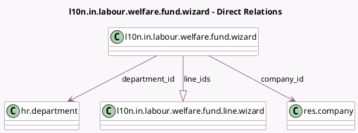

<!-- GENERATED:MODEL -->
---
tags: [odoo, enterprise, generated, model]
---

# l10n.in.labour.welfare.fund.wizard

- Module: [[docs/Enterprise Addons/l10n_in_hr_payroll/l10n_in_hr_payroll|l10n_in_hr_payroll]]
- Scope: Enterprise Addons
- Defined in module: yes
- Source files: `wizard/l10n_in_labour_welfare_fund_wizard.py`
- Python classes: `L10nInLabourWelfareFundWizard`
- Description: Labour Welfare Fund

## Field footprint

- Detected fields: 6
- Field types: `Date` x 2, `Many2one` x 3, `One2many` x 1
- Relation fields: 4

## Sample fields

- `company_id`: `Many2one` (comodel `res.company`)
- `currency_id`: `Many2one` (related `company_id.currency_id`)
- `date_from`: `Date`
- `date_to`: `Date`
- `department_id`: `Many2one` (comodel `hr.department`)
- `line_ids`: `One2many` (comodel `l10n.in.labour.welfare.fund.line.wizard`, compute `_compute_line_ids`, store `True`)

## Method hints

- Detected methods: 2
- Action methods: `action_export_xls`
- Compute methods: `_compute_line_ids`
- Onchange methods: none

## Direct relation diagram

## Navigation

- **Parent:** [[docs/Enterprise Addons/l10n_in_hr_payroll/Models]]

<!-- GENERATED:MODEL -->
