<!-- GENERATED:MODEL -->
---
tags: [odoo, enterprise, generated, model]
---

# l10n.in.tds.computation.wizard

- Module: [[docs/Enterprise Addons/l10n_in_hr_payroll/l10n_in_hr_payroll|l10n_in_hr_payroll]]
- Scope: Enterprise Addons
- Defined in module: yes
- Source files: `wizard/hr_tds_calculation.py`
- Python classes: `L10nInTdsComputationWizard`
- Description: Indian Payroll: TDS computation

## Field footprint

- Detected fields: 14
- Field types: `Float` x 11, `Many2one` x 3
- Relation fields: 3

## Sample fields

- `cess`: `Float` (compute `_compute_taxable_income`)
- `currency_id`: `Many2one` (comodel `res.currency`)
- `net_monthly`: `Float` (compute `_compute_net_monthly`)
- `payslip_id`: `Many2one` (comodel `hr.payslip`)
- `rebate`: `Float` (compute `_compute_taxable_income`)
- `standard_deduction`: `Float`
- `surcharge`: `Float` (compute `_compute_taxable_income`)
- `tax_on_taxable_income`: `Float` (compute `_compute_taxable_income`)
- `taxable_income`: `Float` (compute `_compute_taxable_income`)
- `tds_monthly`: `Float` (compute `_compute_tds_monthly`, store `True`)
- `total_income`: `Float` (compute `_compute_total_income`)
- `total_tax`: `Float` (compute `_compute_taxable_income`)
- `total_tax_on_income`: `Float` (compute `_compute_taxable_income`)
- `version_id`: `Many2one` (comodel `hr.version`)

## Method hints

- Detected methods: 6
- Action methods: none
- Compute methods: `_compute_net_monthly`, `_compute_taxable_income`, `_compute_tds_monthly`, `_compute_total_income`
- Onchange methods: none

## Direct relation diagram

```plantuml
@startuml
!define ODOO_COLOR_PRIMARY #714B67
!define ODOO_COLOR_ACCENT #875A7B
!define ODOO_COLOR_BG #FAF7FA

skinparam backgroundColor ODOO_COLOR_BG
skinparam defaultTextAlignment left
skinparam ArrowColor ODOO_COLOR_ACCENT
skinparam ClassBackgroundColor white
skinparam ClassBorderColor ODOO_COLOR_PRIMARY
skinparam ComponentBackgroundColor white
skinparam ComponentBorderColor ODOO_COLOR_PRIMARY
skinparam NoteBackgroundColor #FFF8FF
skinparam NoteBorderColor ODOO_COLOR_ACCENT
skinparam SequenceLifeLineBorderColor ODOO_COLOR_ACCENT
skinparam SequenceLifeLineBackgroundColor #FFFFFF
skinparam SequenceParticipantBorderColor ODOO_COLOR_PRIMARY
skinparam SequenceParticipantBackgroundColor #FFFFFF
skinparam sequence {
  ArrowColor ODOO_COLOR_ACCENT
  ActorBorderColor ODOO_COLOR_PRIMARY
}
title l10n.in.tds.computation.wizard - Direct Relations
class "l10n.in.tds.computation.wizard" as l10n_in_tds_computation_wizard
class "hr.payslip" as hr_payslip
class "hr.version" as hr_version
class "res.currency" as res_currency
l10n_in_tds_computation_wizard --> hr_version : version_id
l10n_in_tds_computation_wizard --> hr_payslip : payslip_id
l10n_in_tds_computation_wizard --> res_currency : currency_id
@enduml
```

## Navigation

- **Parent:** [[docs/Enterprise Addons/l10n_in_hr_payroll/Models]]

<!-- GENERATED:MODEL -->
