<!-- GENERATED:MODEL -->
---
tags: [odoo, enterprise, generated, model]
---

# salary.register.wizard

- Module: [[docs/Enterprise Addons/l10n_in_hr_payroll/l10n_in_hr_payroll|l10n_in_hr_payroll]]
- Scope: Enterprise Addons
- Defined in module: yes
- Source files: `wizard/hr_salary_register.py`
- Python classes: `SalaryRegisterWizard`
- Description: Salary Register

## Field footprint

- Detected fields: 7
- Field types: `Boolean` x 2, `Date` x 2, `Many2many` x 1, `Many2one` x 2
- Relation fields: 3

## Sample fields

- `company_id`: `Many2one` (comodel `res.company`)
- `date_from`: `Date`
- `date_to`: `Date`
- `employee_ids`: `Many2many` (comodel `hr.employee`, compute `_compute_employee_ids`, store `True`)
- `include_done`: `Boolean` (compute `_compute_include_done`, store `True`)
- `include_paid`: `Boolean` (compute `_compute_include_paid`, store `True`)
- `struct_id`: `Many2one` (comodel `hr.payroll.structure`)

## Method hints

- Detected methods: 10
- Action methods: `action_export_xlsx`
- Compute methods: `_compute_employee_ids`, `_compute_include_done`, `_compute_include_paid`
- Onchange methods: none

## Direct relation diagram

```plantuml
@startuml
!define ODOO_COLOR_PRIMARY #714B67
!define ODOO_COLOR_ACCENT #875A7B
!define ODOO_COLOR_BG #FAF7FA

skinparam backgroundColor ODOO_COLOR_BG
skinparam defaultTextAlignment left
skinparam ArrowColor ODOO_COLOR_ACCENT
skinparam ClassBackgroundColor white
skinparam ClassBorderColor ODOO_COLOR_PRIMARY
skinparam ComponentBackgroundColor white
skinparam ComponentBorderColor ODOO_COLOR_PRIMARY
skinparam NoteBackgroundColor #FFF8FF
skinparam NoteBorderColor ODOO_COLOR_ACCENT
skinparam SequenceLifeLineBorderColor ODOO_COLOR_ACCENT
skinparam SequenceLifeLineBackgroundColor #FFFFFF
skinparam SequenceParticipantBorderColor ODOO_COLOR_PRIMARY
skinparam SequenceParticipantBackgroundColor #FFFFFF
skinparam sequence {
  ArrowColor ODOO_COLOR_ACCENT
  ActorBorderColor ODOO_COLOR_PRIMARY
}
title salary.register.wizard - Direct Relations
class "salary.register.wizard" as salary_register_wizard
class "hr.employee" as hr_employee
class "hr.payroll.structure" as hr_payroll_structure
class "res.company" as res_company
salary_register_wizard .. hr_employee : employee_ids
salary_register_wizard --> res_company : company_id
salary_register_wizard --> hr_payroll_structure : struct_id
@enduml
```

## Navigation

- **Parent:** [[docs/Enterprise Addons/l10n_in_hr_payroll/Models]]

<!-- GENERATED:MODEL -->
