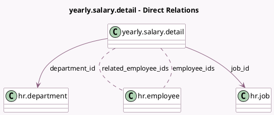

<!-- GENERATED:MODEL -->
---
tags: [odoo, enterprise, generated, model]
---

# yearly.salary.detail

- Module: [[docs/Enterprise Addons/l10n_in_hr_payroll/l10n_in_hr_payroll|l10n_in_hr_payroll]]
- Scope: Enterprise Addons
- Defined in module: yes
- Source files: `wizard/hr_yearly_salary_detail.py`
- Python classes: `YearlySalaryDetail`
- Description: Hr Salary Employee By Category Report

## Field footprint

- Detected fields: 5
- Field types: `Many2many` x 2, `Many2one` x 2, `Selection` x 1
- Relation fields: 4

## Sample fields

- `department_id`: `Many2one` (comodel `hr.department`)
- `employee_ids`: `Many2many` (comodel `hr.employee`, compute `_compute_employee_ids`, store `True`)
- `job_id`: `Many2one` (comodel `hr.job`)
- `related_employee_ids`: `Many2many` (comodel `hr.employee`, compute `_compute_related_employee_ids`)
- `year`: `Selection`

## Method hints

- Detected methods: 6
- Action methods: none
- Compute methods: `_compute_employee_ids`, `_compute_related_employee_ids`
- Onchange methods: none

## Direct relation diagram

## Navigation

- **Parent:** [[docs/Enterprise Addons/l10n_in_hr_payroll/Models]]

<!-- GENERATED:MODEL -->
