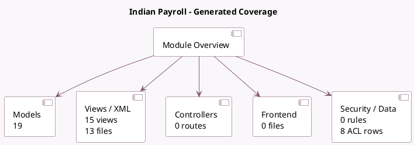

<!-- GENERATED:MODULE -->
---
tags: [odoo, enterprise, module]
---

# Indian Payroll

- Scope: Enterprise Addons
- Source: enterprise/l10n_in_hr_payroll
- Dependencies: [[docs/Enterprise Addons/hr_payroll_holidays/hr_payroll_holidays|hr_payroll_holidays]], [[docs/Enterprise Addons/hr_payroll/hr_payroll|hr_payroll]]

## Generated coverage

- Models: 19
- XML files with UI/data artifacts: 13
- Views: 15
- Actions: 12
- Menus: 7
- Rules (ir.rule): 0
- Access CSV entries: 8
- Controller units: 0
- Frontend asset files: 0

## Module map

## Detail notes

- Models: [[docs/Enterprise Addons/l10n_in_hr_payroll/Models|Models]] (19)
- Views and XML: [[docs/Enterprise Addons/l10n_in_hr_payroll/Views|Views]] (13 files)

## Key models

- `hr.employee`
- `hr.payroll.payment.report.wizard`
- `hr.payroll.structure.type`
- `hr.payslip`
- `hr.payslip.run`
- `hr.version`
- `l10n.in.hr.payroll.epf.report`
- `l10n.in.hr.payroll.esic.report`
- `l10n.in.labour.welfare.fund.line.wizard`
- `l10n.in.labour.welfare.fund.wizard`
- `l10n.in.tds.computation.wizard`
- `l10n_in_hr_payroll.salary.statement`

## Navigation

- [[../Enterprise Addons/Enterprise Addons|Back to scope]]
- [[../../docs/docs|Back to docs]]

<!-- GENERATED:MODULE -->

