<!-- GENERATED:MODEL -->
---
tags: [odoo, enterprise, generated, model]
---

# account.batch.payment

- Module: [[docs/Enterprise Addons/l10n_in_reports/l10n_in_reports|l10n_in_reports]]
- Scope: Enterprise Addons
- Defined in module: extension only
- Source files: `models/account_batch_payment.py`
- Python classes: `AccountBatchPayment`

## Field footprint

- Detected fields: 3
- Field types: `Boolean` x 1, `Char` x 1, `Many2many` x 1
- Relation fields: 1

## Sample fields

- `country_code`: `Char` (related `journal_id.country_code`)
- `l10n_in_enet_vendor_batch_payment_feature_enabled`: `Boolean` (related `company_id.l10n_in_enet_vendor_batch_payment_feature`)
- `l10n_in_pay_order_attachment_ids`: `Many2many` (comodel `ir.attachment`)

## Method hints

- Detected methods: 4
- Action methods: none
- Compute methods: none
- Onchange methods: none

## Direct relation diagram

```plantuml
@startuml
!define ODOO_COLOR_PRIMARY #714B67
!define ODOO_COLOR_ACCENT #875A7B
!define ODOO_COLOR_BG #FAF7FA

skinparam backgroundColor ODOO_COLOR_BG
skinparam defaultTextAlignment left
skinparam ArrowColor ODOO_COLOR_ACCENT
skinparam ClassBackgroundColor white
skinparam ClassBorderColor ODOO_COLOR_PRIMARY
skinparam ComponentBackgroundColor white
skinparam ComponentBorderColor ODOO_COLOR_PRIMARY
skinparam NoteBackgroundColor #FFF8FF
skinparam NoteBorderColor ODOO_COLOR_ACCENT
skinparam SequenceLifeLineBorderColor ODOO_COLOR_ACCENT
skinparam SequenceLifeLineBackgroundColor #FFFFFF
skinparam SequenceParticipantBorderColor ODOO_COLOR_PRIMARY
skinparam SequenceParticipantBackgroundColor #FFFFFF
skinparam sequence {
  ArrowColor ODOO_COLOR_ACCENT
  ActorBorderColor ODOO_COLOR_PRIMARY
}
title account.batch.payment - Direct Relations
class "account.batch.payment" as account_batch_payment
class "ir.attachment" as ir_attachment
account_batch_payment .. ir_attachment : l10n_in_pay_order_attachment_ids
@enduml
```

## Navigation

- **Parent:** [[docs/Enterprise Addons/l10n_in_reports/Models]]

<!-- GENERATED:MODEL -->
