<!-- GENERATED:MODEL -->
---
tags: [odoo, enterprise, generated, model]
---

# account.journal

- Module: [[docs/Enterprise Addons/l10n_in_reports/l10n_in_reports|l10n_in_reports]]
- Scope: Enterprise Addons
- Defined in module: extension only
- Source files: `models/account_journal.py`
- Python classes: `AccountJournal`

## Field footprint

- Detected fields: 4
- Field types: `Boolean` x 3, `Many2one` x 1
- Relation fields: 1

## Sample fields

- `bank_template_id`: `Many2one` (comodel `enet.bank.template`)
- `has_enet_payment_method`: `Boolean` (compute `_compute_has_enet_payment_method`)
- `l10n_in_enet_vendor_batch_payment_feature_enabled`: `Boolean` (related `company_id.l10n_in_enet_vendor_batch_payment_feature`)
- `l10n_in_fetch_vendor_edi_feature_enabled`: `Boolean` (related `company_id.l10n_in_fetch_vendor_edi_feature`)

## Method hints

- Detected methods: 2
- Action methods: none
- Compute methods: `_compute_has_enet_payment_method`
- Onchange methods: none

## Direct relation diagram

```plantuml
@startuml
!define ODOO_COLOR_PRIMARY #714B67
!define ODOO_COLOR_ACCENT #875A7B
!define ODOO_COLOR_BG #FAF7FA

skinparam backgroundColor ODOO_COLOR_BG
skinparam defaultTextAlignment left
skinparam ArrowColor ODOO_COLOR_ACCENT
skinparam ClassBackgroundColor white
skinparam ClassBorderColor ODOO_COLOR_PRIMARY
skinparam ComponentBackgroundColor white
skinparam ComponentBorderColor ODOO_COLOR_PRIMARY
skinparam NoteBackgroundColor #FFF8FF
skinparam NoteBorderColor ODOO_COLOR_ACCENT
skinparam SequenceLifeLineBorderColor ODOO_COLOR_ACCENT
skinparam SequenceLifeLineBackgroundColor #FFFFFF
skinparam SequenceParticipantBorderColor ODOO_COLOR_PRIMARY
skinparam SequenceParticipantBackgroundColor #FFFFFF
skinparam sequence {
  ArrowColor ODOO_COLOR_ACCENT
  ActorBorderColor ODOO_COLOR_PRIMARY
}
title account.journal - Direct Relations
class "account.journal" as account_journal
class "enet.bank.template" as enet_bank_template
account_journal --> enet_bank_template : bank_template_id
@enduml
```

## Navigation

- **Parent:** [[docs/Enterprise Addons/l10n_in_reports/Models]]

<!-- GENERATED:MODEL -->
