<!-- GENERATED:MODEL -->
---
tags: [odoo, enterprise, generated, model]
---

# account.move

- Module: [[docs/Enterprise Addons/l10n_in_reports/l10n_in_reports|l10n_in_reports]]
- Scope: Enterprise Addons
- Defined in module: extension only
- Source files: `models/account_move.py`
- Python classes: `AccountMove`

## Field footprint

- Detected fields: 9
- Field types: `Boolean` x 3, `Char` x 1, `Html` x 1, `Many2one` x 1, `Selection` x 3
- Relation fields: 1

## Sample fields

- `l10n_in_account_return_id`: `Many2one` (comodel `account.return`)
- `l10n_in_exception`: `Html` (comodel `Exception`)
- `l10n_in_fetch_vendor_edi_feature_enabled`: `Boolean` (related `company_id.l10n_in_fetch_vendor_edi_feature`)
- `l10n_in_gst_efiling_feature_enabled`: `Boolean` (related `company_id.l10n_in_gst_efiling_feature`)
- `l10n_in_gstr2b_reconciliation_status`: `Selection`
- `l10n_in_gstr_activate_einvoice_fetch`: `Selection` (related `company_id.l10n_in_gstr_activate_einvoice_fetch`)
- `l10n_in_irn_number`: `Char` (comodel `IRN Number`)
- `l10n_in_reversed_entry_warning`: `Boolean` (compute `_compute_l10n_in_reversed_entry_warning`)
- `l10n_in_transaction_type`: `Selection` (compute `_compute_l10n_in_transaction_type`, store `True`)

## Method hints

- Detected methods: 21
- Action methods: `action_l10n_in_bill_reset_gstr2b_manual_matching`, `action_l10n_in_bill_set_gstr2b_manual_matching`
- Compute methods: `_compute_l10n_in_reversed_entry_warning`, `_compute_l10n_in_transaction_type`
- Onchange methods: none

## Direct relation diagram

```plantuml
@startuml
!define ODOO_COLOR_PRIMARY #714B67
!define ODOO_COLOR_ACCENT #875A7B
!define ODOO_COLOR_BG #FAF7FA

skinparam backgroundColor ODOO_COLOR_BG
skinparam defaultTextAlignment left
skinparam ArrowColor ODOO_COLOR_ACCENT
skinparam ClassBackgroundColor white
skinparam ClassBorderColor ODOO_COLOR_PRIMARY
skinparam ComponentBackgroundColor white
skinparam ComponentBorderColor ODOO_COLOR_PRIMARY
skinparam NoteBackgroundColor #FFF8FF
skinparam NoteBorderColor ODOO_COLOR_ACCENT
skinparam SequenceLifeLineBorderColor ODOO_COLOR_ACCENT
skinparam SequenceLifeLineBackgroundColor #FFFFFF
skinparam SequenceParticipantBorderColor ODOO_COLOR_PRIMARY
skinparam SequenceParticipantBackgroundColor #FFFFFF
skinparam sequence {
  ArrowColor ODOO_COLOR_ACCENT
  ActorBorderColor ODOO_COLOR_PRIMARY
}
title account.move - Direct Relations
class "account.move" as account_move
class "account.return" as account_return
account_move --> account_return : l10n_in_account_return_id
@enduml
```

## Navigation

- **Parent:** [[docs/Enterprise Addons/l10n_in_reports/Models]]

<!-- GENERATED:MODEL -->
