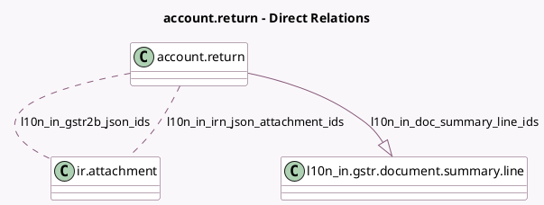

<!-- GENERATED:MODEL -->
---
tags: [odoo, enterprise, generated, model]
---

# account.return

- Module: [[docs/Enterprise Addons/l10n_in_reports/l10n_in_reports|l10n_in_reports]]
- Scope: Enterprise Addons
- Defined in module: extension only
- Source files: `models/account_return.py`
- Python classes: `AccountReturn`

## Field footprint

- Detected fields: 13
- Field types: `Boolean` x 1, `Char` x 2, `Date` x 1, `Many2many` x 2, `One2many` x 1, `Selection` x 6
- Relation fields: 3

## Sample fields

- `l10n_in_doc_summary_line_ids`: `One2many` (comodel `l10n_in.gstr.document.summary.line`)
- `l10n_in_fetch_vendor_edi_feature_enabled`: `Boolean` (related `company_id.l10n_in_fetch_vendor_edi_feature`)
- `l10n_in_gstr1_blocking_level`: `Selection`
- `l10n_in_gstr1_status`: `Selection`
- `l10n_in_gstr2b_blocking_level`: `Selection`
- `l10n_in_gstr2b_json_ids`: `Many2many` (comodel `ir.attachment`)
- `l10n_in_gstr2b_status`: `Selection`
- `l10n_in_gstr_activate_einvoice_fetch`: `Selection` (related `company_id.l10n_in_gstr_activate_einvoice_fetch`)
- `l10n_in_gstr_reference`: `Char`
- `l10n_in_irn_fetch_date`: `Date`
- `l10n_in_irn_json_attachment_ids`: `Many2many` (comodel `ir.attachment`)
- `l10n_in_irn_status`: `Selection`
- `l10n_in_month_year`: `Char` (compute `_compute_rtn_period_month_year`, store `True`)

## Method hints

- Detected methods: 58
- Action methods: `action_check_gstr_status`, `action_generate_document_summary`, `action_generate_gstr1_xlsx`, `action_get_gstr2b_view_reconciled_invoice`, `action_get_l10n_in_gstr2b_data`, `action_gstr2b_fetch`, `action_l10n_in_get_irn_data`, `action_l10n_in_send_gstr1`, and 3 more
- Compute methods: `_compute_rtn_period_month_year`, `_compute_show_submit_button`, `_compute_visible_states`
- Onchange methods: none

## Direct relation diagram

## Navigation

- **Parent:** [[docs/Enterprise Addons/l10n_in_reports/Models]]

<!-- GENERATED:MODEL -->
