<!-- GENERATED:MODEL -->
---
tags: [odoo, enterprise, generated, model]
---

# l10n_in.gstr.document.summary.line

- Module: [[docs/Enterprise Addons/l10n_in_reports/l10n_in_reports|l10n_in_reports]]
- Scope: Enterprise Addons
- Defined in module: yes
- Source files: `models/gstr_document_summary.py`
- Python classes: `GSTRDocumentSummaryLine`
- Description: GSTR Document Summary Line

## Field footprint

- Detected fields: 8
- Field types: `Char` x 2, `Integer` x 3, `Many2one` x 2, `Selection` x 1
- Relation fields: 2

## Sample fields

- `company_id`: `Many2one` (related `return_period_id.company_id`)
- `nature_of_document`: `Selection`
- `net_issued`: `Integer` (compute `_compute_net_issued`)
- `return_period_id`: `Many2one` (comodel `account.return`)
- `serial_from`: `Char`
- `serial_to`: `Char`
- `total_cancelled`: `Integer`
- `total_issued`: `Integer` (compute `_compute_total_issued`, store `True`)

## Method hints

- Detected methods: 3
- Action methods: none
- Compute methods: `_compute_net_issued`, `_compute_total_issued`
- Onchange methods: none

## Direct relation diagram

```plantuml
@startuml
!define ODOO_COLOR_PRIMARY #714B67
!define ODOO_COLOR_ACCENT #875A7B
!define ODOO_COLOR_BG #FAF7FA

skinparam backgroundColor ODOO_COLOR_BG
skinparam defaultTextAlignment left
skinparam ArrowColor ODOO_COLOR_ACCENT
skinparam ClassBackgroundColor white
skinparam ClassBorderColor ODOO_COLOR_PRIMARY
skinparam ComponentBackgroundColor white
skinparam ComponentBorderColor ODOO_COLOR_PRIMARY
skinparam NoteBackgroundColor #FFF8FF
skinparam NoteBorderColor ODOO_COLOR_ACCENT
skinparam SequenceLifeLineBorderColor ODOO_COLOR_ACCENT
skinparam SequenceLifeLineBackgroundColor #FFFFFF
skinparam SequenceParticipantBorderColor ODOO_COLOR_PRIMARY
skinparam SequenceParticipantBackgroundColor #FFFFFF
skinparam sequence {
  ArrowColor ODOO_COLOR_ACCENT
  ActorBorderColor ODOO_COLOR_PRIMARY
}
title l10n_in.gstr.document.summary.line - Direct Relations
class "l10n_in.gstr.document.summary.line" as l10n_in_gstr_document_summary_line
class "account.return" as account_return
l10n_in_gstr_document_summary_line --> account_return : return_period_id
@enduml
```

## Navigation

- **Parent:** [[docs/Enterprise Addons/l10n_in_reports/Models]]

<!-- GENERATED:MODEL -->
