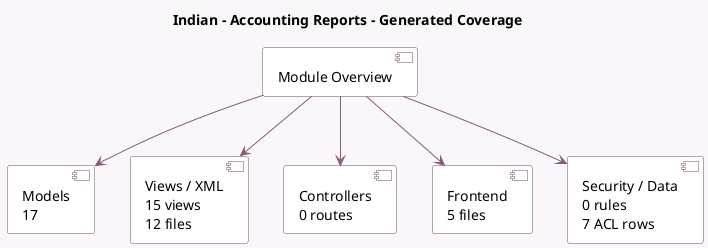

<!-- GENERATED:MODULE -->
---
tags: [odoo, enterprise, module]
---

# Indian - Accounting Reports

- Scope: Enterprise Addons
- Source: enterprise/l10n_in_reports
- Dependencies: [[docs/Community Addons/l10n_in/l10n_in|l10n_in]], [[docs/Enterprise Addons/account_reports/account_reports|account_reports]], [[docs/Enterprise Addons/accountant/accountant|accountant]], [[docs/Enterprise Addons/account_batch_payment/account_batch_payment|account_batch_payment]], [[docs/Community Addons/barcodes/barcodes|barcodes]], [[docs/Enterprise Addons/account_invoice_extract/account_invoice_extract|account_invoice_extract]]

## Generated coverage

- Models: 17
- XML files with UI/data artifacts: 12
- Views: 15
- Actions: 3
- Menus: 3
- Rules (ir.rule): 0
- Access CSV entries: 7
- Controller units: 0
- Frontend asset files: 5

## Module map

## Detail notes

- Models: [[docs/Enterprise Addons/l10n_in_reports/Models|Models]] (17)
- Views and XML: [[docs/Enterprise Addons/l10n_in_reports/Views|Views]] (12 files)
- Frontend: [[docs/Enterprise Addons/l10n_in_reports/Frontend|Frontend]] (5 files)

## Key models

- `account.batch.payment`
- `account.journal`
- `account.move`
- `account.payment`
- `account.payment.method`
- `account.report`
- `account.return`
- `account.return.check`
- `account.return.type`
- `enet.bank.template`
- `ir.attachment`
- `l10n_in.gst.otp.validation`

## Navigation

- [[../Enterprise Addons/Enterprise Addons|Back to scope]]
- [[../../docs/docs|Back to docs]]

<!-- GENERATED:MODULE -->

