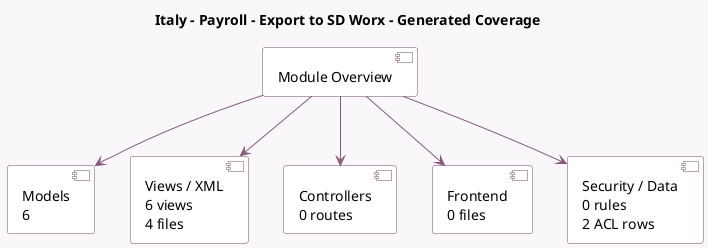

<!-- GENERATED:MODULE -->
---
tags: [odoo, enterprise, module]
---

# Italy - Payroll - Export to SD Worx

- Scope: Enterprise Addons
- Source: enterprise/l10n_it_hr_payroll_sd_worx
- Dependencies: [[docs/Enterprise Addons/hr_payroll/hr_payroll|hr_payroll]]

## Summary

Export Work Entries to SD Worx

## Generated coverage

- Models: 6
- XML files with UI/data artifacts: 4
- Views: 6
- Actions: 1
- Menus: 2
- Rules (ir.rule): 0
- Access CSV entries: 2
- Controller units: 0
- Frontend asset files: 0

## Module map

## Detail notes

- Models: [[docs/Enterprise Addons/l10n_it_hr_payroll_sd_worx/Models|Models]] (6)
- Views and XML: [[docs/Enterprise Addons/l10n_it_hr_payroll_sd_worx/Views|Views]] (4 files)

## Key models

- `hr.employee`
- `hr.work.entry.type`
- `l10n.it.hr.payroll.export.sdworx`
- `l10n.it.hr.payroll.export.sdworx.employee`
- `res.company`
- `res.config.settings`

## Navigation

- [[../Enterprise Addons/Enterprise Addons|Back to scope]]
- [[../../docs/docs|Back to docs]]

<!-- GENERATED:MODULE -->

